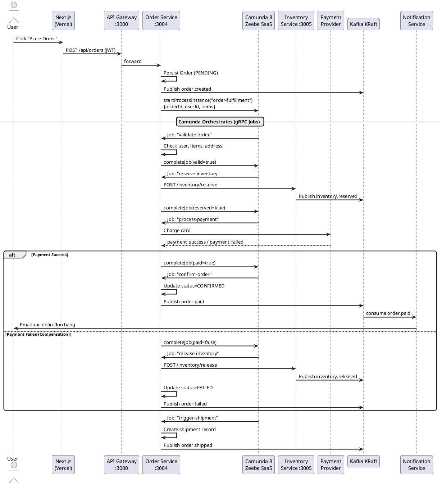
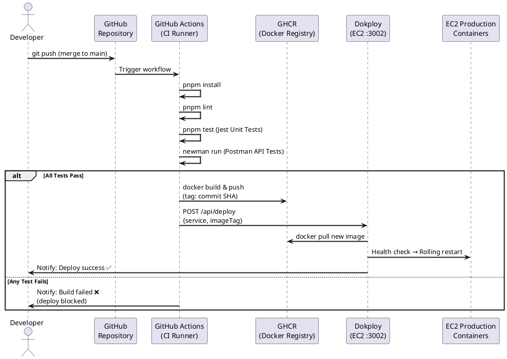

# 📋 E-Commerce MVP — Kế Hoạch Dự Án Chi Tiết

> **Phiên bản:** 1.0 | **Cập nhật:** 21/04/2026
> **Team:** 1 Fullstack Developer + 1 QA/Tester
> **Thời gian:** Tháng 4/2026 → Tháng 8/2026 (8 Sprints × 2 tuần)
> **Tư duy chủ đạo:** _"Survive First, Scale Later"_ — sống sót trên 1GB RAM, nghiệp vụ đúng trước khi đẹp.

---

## Mục Lục

1. [System Architecture & UML](#1-system-architecture--uml)
2. [Phân Chia Microservices](#2-phân-chia-microservices)
3. [Test Strategy & Code Snippets](#3-test-strategy--code-snippets)
4. [Roadmap & Sprint Planning](#4-roadmap--sprint-planning)
5. [CI/CD Pipeline](#5-cicd-pipeline)

---

## 1. System Architecture & UML

### 1.1 Tổng Quan Hạ Tầng

| Tier            | Thành phần           | Nơi chạy              | Lý do                              |
| --------------- | -------------------- | --------------------- | ---------------------------------- |
| Frontend        | Next.js              | Vercel (Free)         | Zero RAM trên EC2, CDN toàn cầu    |
| API & Workers   | NestJS Microservices | EC2 t3.micro          | Tự kiểm soát tài nguyên            |
| Event Broker    | Kafka KRaft          | EC2 t3.micro          | Bỏ ZooKeeper, tiết kiệm ~150MB RAM |
| Identity        | Keycloak             | EC2 t3.micro          | Heap giới hạn cứng 256MB           |
| Workflow Engine | Camunda 8 Zeebe      | **Camunda SaaS Free** | Đẩy tải hoàn toàn ra ngoài EC2     |
| Database SQL    | PostgreSQL           | AWS RDS Free Tier     | Không chiếm RAM EC2                |
| Database NoSQL  | MongoDB              | MongoDB Atlas M0      | Free, không chiếm RAM EC2          |
| Monitoring      | Prometheus + Grafana | EC2 t3.micro          | Giới hạn retention + heap          |
| CI/CD PaaS      | Dokploy              | EC2 t3.micro          | Self-hosted, lightweight           |

---

### 1.2 Phân Công: Kafka vs. Camunda

```
┌──────────────────────────────┬──────────────────────────────────────┐
│  KAFKA (Async Messaging)     │  CAMUNDA (Process Orchestration)     │
├──────────────────────────────┼──────────────────────────────────────┤
│ • Fire-and-forget events     │ • Multi-step business processes      │
│ • order.created              │ • Order Fulfillment Saga:            │
│ • order.paid                 │   1. validate-order                  │
│ • order.failed               │   2. reserve-inventory               │
│ • inventory.reserved         │   3. process-payment                 │
│ • inventory.released         │   4. confirm-order / compensate      │
│ • user.registered            │   5. trigger-shipment                │
│ • notification.send          │                                      │
│                              │                                      │
│ = "Thông báo điều đã xảy ra" │ = "Điều phối điều phải xảy ra"      │
└──────────────────────────────┴──────────────────────────────────────┘
```

**Quy tắc vàng:**

- **Kafka** = Integration Events (kết quả đã hoàn thành, ai cần thì subscribe)
- **Camunda** = Orchestration Commands (bước tiếp theo trong luồng nghiệp vụ)
- **Order Service** vừa là Zeebe Worker (nhận job từ Camunda) vừa là Kafka Producer (publish kết quả)

---

### 1.3 UML — System Architecture

> **Layout:** Đọc từ **trái → phải** theo chiều request flow.
> Hệ thống tự-host tách thành **2 EC2 t3.micro** liên lạc qua **VPC Private Network**:
>
> - **EC2-A (App Server):** Nginx + 7 NestJS Services + Dokploy · budget ~900 MB RAM
> - **EC2-B (Infra Server):** Kafka KRaft + Keycloak + Prometheus/Grafana · budget ~800 MB RAM

```plantuml
@startuml E-Commerce System Architecture
!theme plain
skinparam componentStyle rectangle
skinparam nodesep 90
skinparam ranksep 110
skinparam padding 16
skinparam defaultFontSize 12
skinparam ArrowColor #444444
skinparam ArrowFontSize 10
skinparam shadowing false

left to right direction

' ══════════════════════════════════════════
' ACTORS
' ══════════════════════════════════════════
actor "End User\n(Browser / Mobile)" as USER
actor "Admin\n(Back-office)"         as ADMIN

' ══════════════════════════════════════════
' TIER 1 — FRONTEND  (Vercel)
' ══════════════════════════════════════════
cloud "Vercel  (Free CDN)" {
  component "Next.js\nSSR + SSG + ISR\nTypeScript · Tailwind" as FE
}

' ══════════════════════════════════════════
' TIER 2 — EC2-A  (App Server)
' ══════════════════════════════════════════
node "EC2-A  ·  t3.micro  ·  1 GB RAM + 4 GB Swap\nApp Server  —  Nginx + NestJS × 7 + Dokploy" as EC2A {

  component "Nginx  :80 / :443\n(SSL Termination  +  Reverse Proxy)" as NGINX

  package "API Layer" {
    component "API Gateway  :3000\nJWT Guard · Rate Limit · Swagger" as GW
  }

  package "Business Microservices  [--max-old-space-size=100]" {
    component "Auth Service  :3001"                         as AUTH
    component "Product Service  :3002"                      as PROD
    component "Cart Service  :3003"                         as CART
    component "Order Service  :3004\n+ Zeebe Worker"        as ORDER
    component "Inventory Service  :3005"                    as INV
    component "Notification Service  :3006\n(Kafka Consumer)" as NOTIF
  }

  component "Dokploy\n(Docker Compose Manager)" as DOKPLOY
}

' ══════════════════════════════════════════
' TIER 3 — EC2-B  (Infra Server)
' ══════════════════════════════════════════
node "EC2-B  ·  t3.micro  ·  1 GB RAM + 4 GB Swap\nInfra Server  —  Kafka + Keycloak + Observability" as EC2B {

  package "Identity Provider" {
    component "Keycloak 24  :8080\nOIDC / OAuth2  ·  -Xmx256m" as KC
  }

  package "Event Broker  (KRaft — No ZooKeeper)" {
    component "Apache Kafka  :9092  Broker\n:9093  Controller  ·  -Xmx128m" as KAFKA
  }

  package "Observability Stack" {
    component "Prometheus  :9090\n(Retention: 3h / 300 MB)" as PROM
    component "Grafana  :3100\nDashboards + Alerts"          as GRAFANA
    component "Node Exporter  :9100\nHost Metrics"           as NODEX
  }
}

' ══════════════════════════════════════════
' TIER 4 — EXTERNAL SaaS & DBs
' ══════════════════════════════════════════
cloud "Camunda 8 SaaS  (Free Plan)" {
  component "Zeebe Engine  :26500\nBPMN Orchestration  gRPC" as ZEEBE
  component "Camunda Operate\n(Process Visibility)"          as OPERATE
}

cloud "Managed DBs  (Free Tier  —  Zero EC2 RAM)" {
  database "AWS RDS  PostgreSQL 16\ndb.t3.micro  Free Tier"  as RDS
  database "MongoDB Atlas  M0\n512 MB Free Cluster"          as MONGO
}

cloud "External APIs" {
  component "Stripe  (Payment  Test Mode)"  as STRIPE
  component "SendGrid  (100 / day Free)"    as SENDGRID
  component "Cloudinary  (Image CDN)"       as CLOUDINARY
}

cloud "GitHub" {
  component "GitHub Actions  CI\nJest → Newman → GHCR → Deploy" as GHCI
}

' ══════════════════════════════════════════
' CONNECTIONS
' ══════════════════════════════════════════

' ① Users → Frontend → EC2-A
USER  -right-> FE    : HTTPS
ADMIN -right-> FE    : HTTPS
FE    -right-> NGINX : HTTPS  REST calls
NGINX -right-> GW

' ② Gateway → Services
GW -down-> AUTH
GW -down-> PROD
GW -down-> CART
GW -down-> ORDER
GW -down-> INV

' ③ Identity  (EC2-A → EC2-B)
AUTH -right-> KC : OIDC  token exchange
GW   -right-> KC : JWT  verify  (JWKS)

' ④ Databases  (Services → External DBs)
AUTH  -right-> RDS   : users · roles
PROD  -right-> RDS   : products · categories
ORDER -right-> RDS   : orders · items
INV   -right-> RDS   : inventory · stock
CART  -right-> MONGO : cart  (TTL 7d)

' ⑤ External APIs
PROD  -right-> CLOUDINARY : image upload
ORDER -right-> STRIPE      : payment intent / webhook

' ⑥ Saga: Order ↔ Camunda  (EC2-A ↔ SaaS, gRPC)
ORDER ..right..> ZEEBE : startProcessInstance  gRPC :26500
ZEEBE ..left..>  ORDER : Job: validate · reserve\n· payment · confirm\n[compensation: release]
ORDER  -right-> OPERATE : process trace

' ⑦ Kafka Publish  (EC2-A → EC2-B via VPC Private IP)
ORDER -right-> KAFKA : order.created · paid · failed
INV   -right-> KAFKA : inventory.reserved · released

' ⑧ Kafka Consume  (EC2-B → EC2-A)
KAFKA -left-> NOTIF : consume  order.paid / shipped
KAFKA -left-> INV   : consume  order.paid  (confirm stock)
NOTIF -right-> SENDGRID : email notification

' ⑨ Observability  (Prometheus scrapes EC2-A from EC2-B)
PROM -left-> GW    : scrape  :3000/metrics
PROM -left-> ORDER : scrape  :3004/metrics
PROM -left-> KAFKA : scrape  JMX Exporter  :9308
NODEX  -right-> PROM : host metrics  (CPU / RAM / Swap)
GRAFANA -left-> PROM : PromQL queries

' ⑩ CI/CD
GHCI    -down-> DOKPLOY : deploy  webhook  (after CI pass)
DOKPLOY -left-> EC2A    : docker pull + rolling restart

@enduml
```



---

### 1.4 UML — Order Fulfillment Saga (Sequence)



---

### 1.5 UML — CI/CD Pipeline (Sequence)



---

## 2. Phân Chia Microservices

### 2.1 Danh Sách Service Core

| Service                  | Port | Database        | Swagger URL      | Trách nhiệm chính                                    |
| ------------------------ | ---- | --------------- | ---------------- | ---------------------------------------------------- |
| **API Gateway**          | 3000 | —               | `:3000/api/docs` | Routing, Rate Limit, JWT verify, Swagger aggregation |
| **Auth Service**         | 3001 | RDS `users`     | `:3001/api/docs` | Register/Login, Keycloak OIDC, token refresh         |
| **Product Service**      | 3002 | RDS `products`  | `:3002/api/docs` | CRUD sản phẩm, danh mục, tìm kiếm, ảnh               |
| **Cart Service**         | 3003 | MongoDB `carts` | `:3003/api/docs` | Add/remove/update giỏ hàng, TTL 7 ngày               |
| **Order Service**        | 3004 | RDS `orders`    | `:3004/api/docs` | Tạo đơn, **Zeebe Worker**, tracking trạng thái       |
| **Inventory Service**    | 3005 | RDS `inventory` | `:3005/api/docs` | Tồn kho, reserve/release, cảnh báo hết hàng          |
| **Notification Service** | 3006 | —               | `:3006/api/docs` | Kafka Consumer → Email (SendGrid Free)               |

### 2.2 Swagger Strategy: Aggregated tại Gateway

```
User/QA truy cập → :3000/api/docs (MASTER Swagger UI)
                         │
          Loads JSON specs từ các service:
          ├── :3001/api/docs-json  (Auth)
          ├── :3002/api/docs-json  (Product)
          ├── :3003/api/docs-json  (Cart)
          ├── :3004/api/docs-json  (Order)
          └── :3005/api/docs-json  (Inventory)
```

**Tối ưu RAM:** Assets Swagger UI (JS/CSS) load từ CDN `cdn.jsdelivr.net` — EC2 chỉ serve file JSON ~50-200KB, tiết kiệm ~30-50MB mỗi NestJS pod.

---

## 3. Test Strategy & Code Snippets

### 3.1 Phân Công: Dev vs. QA (Không Dẫm Chân)

```
┌─────────────────────────────────────────────────────────────────┐
│              PHÂN CÔNG TEST THEO SPRINT                        │
├────────────────────────────┬────────────────────────────────────┤
│  FULLSTACK DEV             │  QA / TESTER                       │
├────────────────────────────┼────────────────────────────────────┤
│ Viết *.spec.ts (Unit Test) │ Viết Postman Collections           │
│ Test logic thuần:          │ Test API qua HTTP thực:            │
│  • calculateTotal()        │  • Happy path (201, schema đúng)   │
│  • cancelOrder()           │  • Negative (400, 401, 403, 404)   │
│  • publishKafkaEvent()     │  • Boundary (items=[], qty=-1)     │
│                            │                                    │
│ KHÔNG test: HTTP layer,    │ KHÔNG test: business logic thuần,  │
│ auth middleware, DB query  │ internal calculations              │
├────────────────────────────┼────────────────────────────────────┤
│ Chạy: pnpm test            │ Chạy: newman run collection.json   │
│ CI gate: Jest coverage 60% │ CI gate: Newman exit code 0        │
└────────────────────────────┴────────────────────────────────────┘
```

**Workflow đồng bộ trong Sprint:**

```
Sprint Day 1-2:  Dev viết DTOs + @ApiProperty → Swagger spec sinh tự động
Sprint Day 2-3:  QA import Swagger URL vào Postman → viết tests (FAIL = expected)
Sprint Day 3-5:  Dev viết Service logic + Unit tests (Jest)
Sprint Day 5-9:  Dev implement → QA chạy Postman tests liên tục → báo bug sớm
Sprint Day 10:   Cả hai pass → sign-off → merge → CI/CD deploy
```

---

### 3.2 Mẫu 1 — Jest Unit Test (NestJS — Order Service)

> **File:** `apps/order-service/src/orders/orders.service.spec.ts`
> **Mục tiêu:** Test logic tính tổng tiền + kiểm tra Kafka publish đúng khi tạo đơn.

```typescript
import { Test, TestingModule } from "@nestjs/testing";
import { getRepositoryToken } from "@nestjs/typeorm";
import { BadRequestException, ConflictException } from "@nestjs/common";
import { OrdersService } from "./orders.service";
import { Order } from "./entities/order.entity";
import { OrderItem } from "./entities/order-item.entity";
import { OrderStatus } from "@ecommerce/common";

// ─── Mock Repositories ────────────────────────────────────────────────────────
const mockOrderRepo = {
  create: jest.fn(),
  save: jest.fn(),
  findOne: jest.fn(),
  find: jest.fn(),
};

const mockOrderItemRepo = {
  create: jest.fn((dto) => dto),
};

// ─── Mock KafkaJS Producer ────────────────────────────────────────────────────
jest.mock("kafkajs", () => ({
  Kafka: jest.fn().mockImplementation(() => ({
    producer: jest.fn().mockReturnValue({
      connect: jest.fn().mockResolvedValue(undefined),
      send: jest.fn().mockResolvedValue([{ topicName: "order.created" }]),
      disconnect: jest.fn().mockResolvedValue(undefined),
    }),
  })),
}));

describe("OrdersService", () => {
  let service: OrdersService;

  beforeEach(async () => {
    const module: TestingModule = await Test.createTestingModule({
      providers: [
        OrdersService,
        { provide: getRepositoryToken(Order), useValue: mockOrderRepo },
        { provide: getRepositoryToken(OrderItem), useValue: mockOrderItemRepo },
      ],
    }).compile();

    service = module.get<OrdersService>(OrdersService);
  });

  afterEach(() => jest.clearAllMocks());

  // ─── calculateTotalAmount() ─────────────────────────────────────────────────

  describe("calculateTotalAmount()", () => {
    it("should return correct total for single item", () => {
      const items = [{ quantity: 2, unitPrice: 150000 }];
      expect(service.calculateTotalAmount(items)).toBe(300000);
    });

    it("should return correct total for multiple items", () => {
      const items = [
        { quantity: 2, unitPrice: 150000 }, // 300.000
        { quantity: 1, unitPrice: 75000 }, //  75.000
        { quantity: 3, unitPrice: 50000 }, // 150.000
      ];
      expect(service.calculateTotalAmount(items)).toBe(525000);
    });

    it("should round to 2 decimal places", () => {
      const items = [{ quantity: 3, unitPrice: 10.1 }]; // 30.3 (no float issue)
      expect(service.calculateTotalAmount(items)).toBe(30.3);
    });

    it("should throw BadRequestException when items is empty", () => {
      expect(() => service.calculateTotalAmount([])).toThrow(
        BadRequestException,
      );
      expect(() => service.calculateTotalAmount([])).toThrow(
        "Order must contain at least 1 item",
      );
    });

    it("should throw BadRequestException when quantity is 0", () => {
      const items = [{ quantity: 0, unitPrice: 100 }];
      expect(() => service.calculateTotalAmount(items)).toThrow(
        BadRequestException,
      );
    });

    it("should throw BadRequestException when unitPrice is negative", () => {
      const items = [{ quantity: 1, unitPrice: -500 }];
      expect(() => service.calculateTotalAmount(items)).toThrow(
        BadRequestException,
      );
    });
  });

  // ─── createOrder() ──────────────────────────────────────────────────────────

  describe("createOrder()", () => {
    const dto = {
      userId: "user-uuid-001",
      items: [{ productId: "prod-uuid-001", quantity: 2, unitPrice: 150000 }],
    };

    it("should persist order with correct totalAmount", async () => {
      const savedOrder = {
        id: "order-uuid-001",
        userId: dto.userId,
        status: OrderStatus.PENDING,
        totalAmount: 300000,
        items: dto.items,
        createdAt: new Date(),
        updatedAt: new Date(),
      };

      mockOrderRepo.create.mockReturnValue(savedOrder);
      mockOrderRepo.save.mockResolvedValue(savedOrder);

      const result = await service.createOrder(dto);

      expect(result.totalAmount).toBe(300000);
      expect(result.status).toBe(OrderStatus.PENDING);
      expect(mockOrderRepo.save).toHaveBeenCalledTimes(1);
    });

    it('should publish "order.created" event to Kafka after save', async () => {
      const savedOrder = {
        id: "order-uuid-002",
        userId: dto.userId,
        totalAmount: 300000,
        status: OrderStatus.PENDING,
        items: dto.items,
        createdAt: new Date(),
        updatedAt: new Date(),
      };

      mockOrderRepo.create.mockReturnValue(savedOrder);
      mockOrderRepo.save.mockResolvedValue(savedOrder);

      // Spy vào private method thông qua prototype
      const publishSpy = jest
        .spyOn(
          service as unknown as { publishKafkaEvent: () => Promise<void> },
          "publishKafkaEvent",
        )
        .mockResolvedValue(undefined);

      await service.createOrder(dto);

      expect(publishSpy).toHaveBeenCalledWith(
        "order.created",
        "order-uuid-002",
        expect.objectContaining({
          orderId: "order-uuid-002",
          totalAmount: 300000,
        }),
      );
    });
  });

  // ─── cancelOrder() ──────────────────────────────────────────────────────────

  describe("cancelOrder()", () => {
    it("should throw ConflictException when order is already CONFIRMED", async () => {
      mockOrderRepo.findOne.mockResolvedValue({
        id: "o1",
        userId: "u1",
        status: OrderStatus.CONFIRMED,
      });

      await expect(service.cancelOrder("o1", "u1")).rejects.toThrow(
        ConflictException,
      );
      await expect(service.cancelOrder("o1", "u1")).rejects.toThrow(
        "Cannot cancel order with status CONFIRMED",
      );
    });

    it("should throw ConflictException when userId does not match", async () => {
      mockOrderRepo.findOne.mockResolvedValue({
        id: "o1",
        userId: "owner-uid",
        status: OrderStatus.PENDING,
      });

      await expect(service.cancelOrder("o1", "other-uid")).rejects.toThrow(
        "You do not own this order",
      );
    });

    it("should update status to CANCELLED for valid PENDING order", async () => {
      const order = { id: "o1", userId: "u1", status: OrderStatus.PENDING };
      mockOrderRepo.findOne.mockResolvedValue(order);
      mockOrderRepo.save.mockResolvedValue({
        ...order,
        status: OrderStatus.CANCELLED,
      });

      const result = await service.cancelOrder("o1", "u1");

      expect(result.status).toBe(OrderStatus.CANCELLED);
      expect(mockOrderRepo.save).toHaveBeenCalledWith(
        expect.objectContaining({ status: OrderStatus.CANCELLED }),
      );
    });
  });
});
```

---

### 3.3 Mẫu 2 — Postman Tests Script (Tab "Tests")

> **Mục tiêu:** QA dán đoạn này vào tab **Tests** của request `POST /api/orders` trong Postman.
> Collection này có thể chạy bằng **Newman** trong CI/CD.

```javascript
// ─── Postman Tests: POST /api/orders ─────────────────────────────────────────
// QA paste đoạn này vào tab "Tests" của Postman request

// 1. Kiểm tra Status Code
pm.test("Status code is 201 Created", function () {
  pm.response.to.have.status(201);
});

// 2. Kiểm tra Response Time (SLA: < 2000ms trên server yếu)
pm.test("Response time is under 2000ms", function () {
  pm.expect(pm.response.responseTime).to.be.below(2000);
});

// 3. Kiểm tra Content-Type
pm.test("Content-Type is application/json", function () {
  pm.response.to.have.header("Content-Type", /application\/json/);
});

// 4. Kiểm tra schema và kiểu dữ liệu của response body
pm.test("Response body has correct structure", function () {
  const body = pm.response.json();

  // id phải là UUID v4
  pm.expect(body).to.have.property("id");
  pm.expect(body.id).to.match(
    /^[0-9a-f]{8}-[0-9a-f]{4}-4[0-9a-f]{3}-[89ab][0-9a-f]{3}-[0-9a-f]{12}$/i,
    "id phải là UUID v4",
  );

  // userId phải đúng với request
  pm.expect(body).to.have.property("userId");
  pm.expect(body.userId).to.be.a("string");

  // status ban đầu phải là PENDING
  pm.expect(body).to.have.property("status");
  pm.expect(body.status).to.eql("PENDING");

  // totalAmount phải là số dương
  pm.expect(body).to.have.property("totalAmount");
  pm.expect(body.totalAmount).to.be.a("number");
  pm.expect(body.totalAmount).to.be.above(0);

  // items phải là array không rỗng
  pm.expect(body).to.have.property("items");
  pm.expect(body.items).to.be.an("array").and.have.length.above(0);

  // Kiểm tra từng item trong order
  body.items.forEach(function (item, index) {
    pm.expect(item, `items[${index}].productId`)
      .to.have.property("productId")
      .that.is.a("string");
    pm.expect(item, `items[${index}].quantity`)
      .to.have.property("quantity")
      .that.is.a("number");
    pm.expect(item.quantity, `items[${index}].quantity > 0`).to.be.above(0);
    pm.expect(item, `items[${index}].unitPrice`)
      .to.have.property("unitPrice")
      .that.is.a("number");
  });

  // createdAt phải là ISO 8601 string
  pm.expect(body).to.have.property("createdAt");
  pm.expect(new Date(body.createdAt).toString()).to.not.eql("Invalid Date");
});

// 5. Tính toán lại totalAmount và kiểm tra server tính đúng
pm.test("Server calculates totalAmount correctly", function () {
  const requestBody = JSON.parse(pm.request.body.raw);
  const responseBody = pm.response.json();

  const expectedTotal = requestBody.items.reduce(function (sum, item) {
    return sum + item.quantity * item.unitPrice;
  }, 0);

  // Làm tròn 2 chữ số thập phân
  const rounded = Math.round(expectedTotal * 100) / 100;
  pm.expect(responseBody.totalAmount).to.eql(rounded);
});

// 6. Lưu orderId vào Collection Variable để dùng ở test tiếp theo (chaining)
const orderId = pm.response.json().id;
pm.collectionVariables.set("lastOrderId", orderId);
pm.test("orderId saved to collection variable for chaining", function () {
  pm.expect(pm.collectionVariables.get("lastOrderId")).to.eql(orderId);
});
```

---

## 4. Roadmap & Sprint Planning

### Tổng Quan Timeline

```
Tháng 4    │ Sprint 1: Infrastructure  │ Sprint 2: Auth + Gateway    │
Tháng 5    │ Sprint 3: Product Service │ Sprint 4: Cart + Inventory  │
Tháng 6    │ Sprint 5: Order + Camunda │ Sprint 6: Payment + Notif   │
Tháng 7-8  │ Sprint 7: Frontend        │ Sprint 8: Monitor + Polish  │
```

---

### Sprint 1 — Infrastructure Foundation _(Tuần 1-2)_

**Mục tiêu:** Môi trường sống được, deploy được.

| #   | Task                                              | Người | Ghi chú                                          |
| --- | ------------------------------------------------- | ----- | ------------------------------------------------ |
| 1   | Tạo EC2 t3.micro, cấu hình Security Groups        | Dev   | Port: 22, 80, 443, 3000-3006, 8080, 9090, 9092   |
| 2   | **Tạo 4GB Swap file** (bắt buộc trước khi làm gì) | Dev   | Script: `infra/setup-swap.sh`                    |
| 3   | Cài Docker + Docker Compose                       | Dev   | Engine only, không dùng Docker Desktop           |
| 4   | Cài Dokploy                                       | Dev   | `curl -sSL https://dokploy.com/install.sh \| sh` |
| 5   | Tạo AWS RDS PostgreSQL Free Tier                  | Dev   | db: `ecommerce_db`, user: `ecom_user`            |
| 6   | Tạo MongoDB Atlas M0                              | Dev   | Collection: `carts`                              |
| 7   | Setup GitHub repo + Monorepo (Turborepo)          | Dev   | `turbo.json`, `pnpm-workspace.yaml`              |
| 8   | Setup Camunda 8 SaaS Free account                 | Dev   | Tạo cluster + lưu API credentials                |
| 9   | **Keycloak container với RAM limit**              | Dev   | `JAVA_OPTS: "-Xmx256m"`                          |
| 10  | **Kafka KRaft Docker Compose**                    | Dev   | `KAFKA_HEAP_OPTS: "-Xmx128m -Xms64m"`            |
| 11  | Viết Smoke Test checklist                         | QA    | Kiểm tra tất cả services up / respond            |
| 12  | Setup Postman Workspace cho team                  | QA    | Shared workspace, environments (dev/staging)     |

**Dev-QA Sync:** QA viết smoke test checklist (services up, ports reachable) ngay khi Dev đang setup infra.

**Deliverable:** `docker-compose up` → tất cả infra containers up, RDS reachable.

---

### Sprint 2 — Auth Service + API Gateway _(Tuần 3-4)_

**Mục tiêu:** Login/Register hoạt động, Gateway routing + Swagger live.

| #   | Task                                                                     | Người |
| --- | ------------------------------------------------------------------------ | ----- |
| 1   | Scaffold NestJS API Gateway (:3000) + proxy routing                      | Dev   |
| 2   | Scaffold NestJS Auth Service (:3001)                                     | Dev   |
| 3   | Integrate Keycloak OIDC (register/login/refresh)                         | Dev   |
| 4   | JWT Guard tại Gateway (verify Keycloak public key)                       | Dev   |
| 5   | **Setup Swagger CDN strategy** tại mỗi service + aggregation tại Gateway | Dev   |
| 6   | Setup GitHub Actions: lint + test on PR                                  | Dev   |
| 7   | Dokploy: Tạo app cho Gateway + Auth, connect GitHub                      | Dev   |
| 8   | **Import Swagger URL vào Postman** → tạo Auth collection                 | QA    |
| 9   | Viết Postman tests: POST /auth/register, POST /auth/login, GET /auth/me  | QA    |
| 10  | Test negative cases: sai password, email duplicate, token hết hạn        | QA    |

**Dev-QA Sync:** Dev expose `/api/docs` → QA import ngay → viết tests song song (test FAIL ở day 3, PASS dần từ day 7).

**Deliverable:** `POST /api/auth/login` trả JWT hợp lệ. Newman chạy Auth collection: tất cả pass.

---

### Sprint 3 — Product Service _(Tuần 5-6)_

**Mục tiêu:** Quản lý sản phẩm đầy đủ, phân quyền Admin/User.

| #   | Task                                                               | Người |
| --- | ------------------------------------------------------------------ | ----- |
| 1   | Scaffold Product Service (:3002), TypeORM entities                 | Dev   |
| 2   | CRUD endpoints + pagination + filter + search                      | Dev   |
| 3   | Image upload → Cloudinary (không lưu trên EC2)                     | Dev   |
| 4   | Admin-only endpoints (tạo/sửa/xóa sản phẩm)                        | Dev   |
| 5   | Unit tests: ProductService (create, update, findAll, search logic) | Dev   |
| 6   | Viết Postman tests: CRUD Product (happy + negative)                | QA    |
| 7   | Test phân quyền: User gọi Admin endpoint → 403                     | QA    |
| 8   | Data-driven test: CSV file với nhiều bộ dữ liệu sản phẩm           | QA    |

**Deliverable:** Admin tạo/sửa/xóa sản phẩm. QA có 40+ Postman tests pass.

---

### Sprint 4 — Cart & Inventory Service _(Tuần 7-8)_

**Mục tiêu:** Giỏ hàng linh hoạt, kho hàng chính xác, không oversell.

| #   | Task                                                                  | Người |
| --- | --------------------------------------------------------------------- | ----- |
| 1   | Scaffold Cart Service (:3003) với MongoDB                             | Dev   |
| 2   | Cart endpoints: add, update qty, remove item, get, clear              | Dev   |
| 3   | Cart TTL: tự xóa sau 7 ngày không hoạt động                           | Dev   |
| 4   | Scaffold Inventory Service (:3005)                                    | Dev   |
| 5   | Reserve/Release inventory với pessimistic locking                     | Dev   |
| 6   | Kafka Producer: publish `inventory.reserved`, `inventory.released`    | Dev   |
| 7   | Unit tests: InventoryService (reserve, release, check stock logic)    | Dev   |
| 8   | Postman tests: Cart CRUD + session behavior                           | QA    |
| 9   | **Test race condition:** 2 requests reserve cùng lúc → không oversell | QA    |
| 10  | Test Kafka event: verify `inventory.reserved` được publish            | QA    |

**Deliverable:** Cart lưu được. Reserve inventory không bị race condition.

---

### Sprint 5 — Order Service + Camunda Saga _(Tuần 9-10)_

**Mục tiêu:** Luồng đặt hàng hoàn chỉnh với Saga pattern.

| #   | Task                                                                       | Người |
| --- | -------------------------------------------------------------------------- | ----- |
| 1   | Scaffold Order Service (:3004)                                             | Dev   |
| 2   | Thiết kế BPMN trên Camunda 8 Modeler                                       | Dev   |
| 3   | Deploy BPMN lên Camunda 8 SaaS cluster                                     | Dev   |
| 4   | Implement Zeebe Client + Job Workers (validate, reserve, pay, ship)        | Dev   |
| 5   | Implement Compensation handlers (release-inventory, refund)                | Dev   |
| 6   | Kafka Producer: order.created/paid/failed/shipped                          | Dev   |
| 7   | **Unit tests: calculateTotalAmount(), cancelOrder(), publishKafkaEvent()** | Dev   |
| 8   | Postman tests: POST /orders (happy path + payment fail scenario)           | QA    |
| 9   | Monitor Camunda Operate: verify đúng process path trace                    | QA    |
| 10  | Test toàn bộ Order Saga: từ create → reserve → pay → confirm               | QA    |

**Deliverable:** Đặt hàng → Camunda orchestrate → inventory reserve → confirmation hoạt động.

---

### Sprint 6 — Payment + Notification + EDA Hoàn Chỉnh _(Tuần 11-12)_

**Mục tiêu:** Thanh toán thực, email xác nhận, hệ thống EDA đầy đủ.

| #   | Task                                                      | Người |
| --- | --------------------------------------------------------- | ----- |
| 1   | Tích hợp Stripe Test Mode (payment intent)                | Dev   |
| 2   | Stripe Webhook handler (payment_intent.succeeded/failed)  | Dev   |
| 3   | Scaffold Notification Service (:3006)                     | Dev   |
| 4   | Kafka Consumer: `order.paid` → send email (SendGrid Free) | Dev   |
| 5   | Kafka Consumer: `inventory.low` → alert admin             | Dev   |
| 6   | Dead Letter Topic (DLT) cho failed Kafka messages         | Dev   |
| 7   | Test E2E với Stripe test card `4242 4242 4242 4242`       | QA    |
| 8   | Verify email nhận được sau order (Mailtrap cho test env)  | QA    |
| 9   | Test Kafka consumer retry: simulate consumer failure      | QA    |
| 10  | Test DLT: verify message vào DLT sau max retries          | QA    |

**Deliverable:** Đặt hàng → thanh toán Stripe → email xác nhận gửi thành công.

---

### Sprint 7 — Frontend Next.js _(Tuần 13-14)_

**Mục tiêu:** Giao diện người dùng hoàn chỉnh, deploy lên Vercel.

| #   | Task                                                         | Người |
| --- | ------------------------------------------------------------ | ----- |
| 1   | Setup Next.js + Tailwind CSS + TypeScript                    | Dev   |
| 2   | Tích hợp Keycloak OIDC (`next-auth` + Keycloak provider)     | Dev   |
| 3   | Pages: Home, Product Listing (SSG), Product Detail (ISR)     | Dev   |
| 4   | Pages: Cart, Checkout Flow                                   | Dev   |
| 5   | Pages: Order History, Order Detail                           | Dev   |
| 6   | Admin Panel: Product management                              | Dev   |
| 7   | Deploy lên Vercel, cấu hình env vars                         | Dev   |
| 8   | **Playwright E2E:** Signup → Browse → Add to Cart → Checkout | QA    |
| 9   | Cross-browser test: Chrome, Firefox, Safari                  | QA    |
| 10  | Mobile responsiveness (Tailwind breakpoints)                 | QA    |

**Deliverable:** Frontend live trên Vercel. User có thể mua hàng end-to-end.

---

### Sprint 8 — Monitoring + Load Test + Polish _(Tuần 15-16)_

**Mục tiêu:** Production-ready, RAM ổn định, tài liệu hoàn chỉnh.

| #   | Task                                                               | Người |
| --- | ------------------------------------------------------------------ | ----- |
| 1   | Cấu hình Grafana dashboards (Node Exporter, Kafka, NestJS metrics) | Dev   |
| 2   | Prometheus alerting rules: RAM > 80%, Swap > 50%                   | Dev   |
| 3   | Load test với k6: 50 concurrent users, 5 phút                      | Dev   |
| 4   | RAM tuning dựa trên load test results                              | Dev   |
| 5   | Review Swagger docs: bổ sung `@ApiOperation` còn thiếu             | Dev   |
| 6   | **k6 Performance test report** (response time, error rate)         | QA    |
| 7   | Security scan cơ bản với OWASP ZAP                                 | QA    |
| 8   | Regression test suite: chạy toàn bộ Postman collections            | QA    |
| 9   | Buffer: Bug fixes từ Sprint 7                                      | Both  |

**Deliverable:** System stable under 50 users. Monitoring dashboards live. Docs complete.

---

## 5. CI/CD Pipeline

### 5.1 Nguyên tắc: "Test Gates First"

```
Push code → Lint → Jest Unit Tests → Newman API Tests
           → [FAIL] Chặn tại đây, KHÔNG deploy
           → [PASS] Docker build → push GHCR → Dokploy deploy
```

### 5.2 RAM Budget EC2 (1024MB Physical + 4GB Swap)

| Component          | RAM Limit | JVM/Node Flag                              |
| ------------------ | --------- | ------------------------------------------ |
| Linux OS + kernel  | ~100MB    | —                                          |
| Dokploy Agent      | ~50MB     | —                                          |
| Docker daemon      | ~50MB     | —                                          |
| **Kafka (KRaft)**  | MAX 200MB | `KAFKA_HEAP_OPTS: "-Xmx128m -Xms64m"`      |
| **Keycloak**       | MAX 320MB | `JAVA_OPTS: "-Xmx256m -Xms128m"`           |
| **Prometheus**     | MAX 150MB | `--storage.tsdb.retention.time=3h`         |
| **Grafana**        | MAX 80MB  | `deploy.resources.limits.memory: 80m`      |
| API Gateway        | MAX 150MB | `NODE_OPTIONS: "--max-old-space-size=128"` |
| Auth Service       | MAX 100MB | `NODE_OPTIONS: "--max-old-space-size=80"`  |
| Product Service    | MAX 100MB | `NODE_OPTIONS: "--max-old-space-size=80"`  |
| Cart Service       | MAX 80MB  | `NODE_OPTIONS: "--max-old-space-size=64"`  |
| Order Service      | MAX 100MB | `NODE_OPTIONS: "--max-old-space-size=80"`  |
| Inventory + Notif  | MAX 80MB  | `NODE_OPTIONS: "--max-old-space-size=64"`  |
| **TOTAL Physical** | ~1,360MB  | → ~336MB overflow to Swap                  |

### 5.3 File: `.github/workflows/main.yml`

```yaml
# .github/workflows/main.yml
name: CI/CD — Test, Build & Deploy

on:
  push:
    branches: [main]
  pull_request:
    branches: [main]

env:
  REGISTRY: ghcr.io
  IMAGE_PREFIX: ghcr.io/${{ github.repository_owner }}/ecommerce

jobs:
  # ─── JOB 1: Lint & Unit Tests ────────────────────────────────────────────────
  test-unit:
    name: Lint & Jest Unit Tests
    runs-on: ubuntu-latest
    steps:
      - name: Checkout
        uses: actions/checkout@v4

      - name: Setup pnpm
        uses: pnpm/action-setup@v3
        with:
          version: 10

      - name: Setup Node.js
        uses: actions/setup-node@v4
        with:
          node-version: "22"
          cache: "pnpm"

      - name: Install dependencies
        run: pnpm install --frozen-lockfile

      - name: Run ESLint
        run: pnpm run lint

      - name: Run Jest unit tests with coverage
        run: pnpm run test:cov
        env:
          CI: true

      # Upload coverage (tùy chọn — free với public repo)
      - name: Upload coverage to Codecov
        if: github.ref == 'refs/heads/main'
        uses: codecov/codecov-action@v4
        with:
          fail_ci_if_error: false

  # ─── JOB 2: API Tests (Newman) ───────────────────────────────────────────────
  test-api:
    name: Newman API Tests
    runs-on: ubuntu-latest
    # Chạy song song với test-unit để tiết kiệm thời gian
    services:
      postgres:
        image: postgres:16-alpine
        env:
          POSTGRES_DB: ecommerce_test
          POSTGRES_USER: test_user
          POSTGRES_PASSWORD: test_pass
        ports:
          - 5432:5432
        options: >-
          --health-cmd pg_isready
          --health-interval 10s
          --health-timeout 5s
          --health-retries 5

    steps:
      - name: Checkout
        uses: actions/checkout@v4

      - name: Setup pnpm + Node.js
        uses: pnpm/action-setup@v3
        with:
          version: 10
      - uses: actions/setup-node@v4
        with:
          node-version: "22"
          cache: "pnpm"

      - name: Install dependencies
        run: pnpm install --frozen-lockfile

      - name: Build services
        run: pnpm run build --filter=@ecommerce/order-service

      - name: Start Order Service (test mode)
        run: |
          cd apps/order-service
          NODE_ENV=test \
          DB_HOST=localhost DB_PORT=5432 \
          DB_USER=test_user DB_PASS=test_pass DB_NAME=ecommerce_test \
          PORT=3004 \
          node dist/main.js &
          # Chờ service ready
          sleep 5
          curl --retry 5 --retry-delay 2 http://localhost:3004/api/docs-json

      - name: Install Newman
        run: npm install -g newman newman-reporter-htmlextra

      - name: Run Postman Collection (Newman)
        run: |
          newman run postman/order-service.collection.json \
            --environment postman/env.ci.json \
            --reporters cli,htmlextra \
            --reporter-htmlextra-export newman-report.html \
            --bail  # Dừng ngay khi có test fail

      - name: Upload Newman report
        if: always()
        uses: actions/upload-artifact@v4
        with:
          name: newman-report
          path: newman-report.html

  # ─── JOB 3: Build & Deploy (chỉ chạy khi cả 2 test jobs pass) ───────────────
  build-and-deploy:
    name: Build Docker & Deploy via Dokploy
    needs: [test-unit, test-api] # ← CHẶN: chỉ chạy khi cả 2 jobs PASS
    runs-on: ubuntu-latest
    if: github.ref == 'refs/heads/main' # ← Chỉ deploy từ nhánh main

    strategy:
      matrix:
        service:
          - api-gateway
          - auth-service
          - product-service
          - cart-service
          - order-service
          - inventory-service
          - notification-service

    steps:
      - name: Checkout
        uses: actions/checkout@v4

      - name: Log in to GHCR
        uses: docker/login-action@v3
        with:
          registry: ${{ env.REGISTRY }}
          username: ${{ github.actor }}
          password: ${{ secrets.GITHUB_TOKEN }} # Tự động, không cần tạo thêm secret

      - name: Build & Push Docker image
        uses: docker/build-push-action@v5
        with:
          context: ./apps/${{ matrix.service }}
          push: true
          tags: |
            ${{ env.IMAGE_PREFIX }}/${{ matrix.service }}:latest
            ${{ env.IMAGE_PREFIX }}/${{ matrix.service }}:${{ github.sha }}
          # Cache layer để tăng tốc build
          cache-from: type=gha
          cache-to: type=gha,mode=max

      - name: Trigger Dokploy Deploy
        run: |
          curl -f -X POST \
            -H "Authorization: Bearer ${{ secrets.DOKPLOY_TOKEN }}" \
            -H "Content-Type: application/json" \
            -d '{
              "appName": "${{ matrix.service }}",
              "imageTag": "${{ github.sha }}"
            }' \
            https://${{ secrets.DOKPLOY_HOST }}/api/deploy
        # -f: fail on HTTP error (4xx/5xx) → workflow fail nếu Dokploy reject
```

### 5.4 Setup Swap File (chạy 1 lần khi provision EC2)

```bash
#!/bin/bash
# infra/setup-swap.sh

set -e

echo "=== Setting up 4GB Swap ==="
sudo fallocate -l 4G /swapfile
sudo chmod 600 /swapfile
sudo mkswap /swapfile
sudo swapon /swapfile

# Persist across reboots
echo '/swapfile none swap sw 0 0' | sudo tee -a /etc/fstab

# Tune: swappiness=60 (cân bằng RAM và swap)
echo 'vm.swappiness=60' | sudo tee -a /etc/sysctl.conf
echo 'vm.vfs_cache_pressure=50' | sudo tee -a /etc/sysctl.conf
sudo sysctl -p

echo "=== Swap setup complete ==="
free -h
```

### 5.5 Docker Compose — Infrastructure Stack

```yaml
# docker-compose.infra.yml
# Chạy: docker-compose -f docker-compose.infra.yml up -d
version: "3.9"

services:
  kafka:
    image: confluentinc/cp-kafka:7.6.0
    container_name: kafka
    restart: unless-stopped
    environment:
      KAFKA_PROCESS_ROLES: "broker,controller"
      KAFKA_NODE_ID: 1
      KAFKA_CONTROLLER_QUORUM_VOTERS: "1@kafka:9093"
      KAFKA_LISTENERS: "PLAINTEXT://:9092,CONTROLLER://:9093"
      KAFKA_ADVERTISED_LISTENERS: "PLAINTEXT://kafka:9092"
      KAFKA_LOG_DIRS: "/var/lib/kafka/data"
      KAFKA_AUTO_CREATE_TOPICS_ENABLE: "true"
      KAFKA_HEAP_OPTS: "-Xmx128m -Xms64m"
      KAFKA_JVM_PERFORMANCE_OPTS: "-server -XX:+UseG1GC -XX:MaxGCPauseMillis=20"
      CLUSTER_ID: "MkU3OEVBNTcwNTJENDM2Qg"
    ports:
      - "9092:9092"
    volumes:
      - kafka-data:/var/lib/kafka/data
    deploy:
      resources:
        limits:
          memory: 200m

  keycloak:
    image: quay.io/keycloak/keycloak:24.0
    container_name: keycloak
    restart: unless-stopped
    command: start
    environment:
      KC_DB: postgres
      KC_DB_URL: jdbc:postgresql://${RDS_HOST}:5432/keycloak
      KC_DB_USERNAME: ${RDS_USER}
      KC_DB_PASSWORD: ${RDS_PASS}
      KC_HOSTNAME: ${KEYCLOAK_HOSTNAME}
      KC_HTTP_ENABLED: "true"
      JAVA_OPTS_APPEND: >-
        -Xmx256m -Xms128m
        -XX:+UseG1GC
        -XX:MaxGCPauseMillis=100
    ports:
      - "8080:8080"
    deploy:
      resources:
        limits:
          memory: 320m

  prometheus:
    image: prom/prometheus:v2.51.0
    container_name: prometheus
    restart: unless-stopped
    command:
      - "--config.file=/etc/prometheus/prometheus.yml"
      - "--storage.tsdb.path=/prometheus"
      - "--storage.tsdb.retention.time=3h"
      - "--storage.tsdb.retention.size=300MB"
      - "--web.enable-lifecycle"
    ports:
      - "9090:9090"
    volumes:
      - ./infra/prometheus/prometheus.yml:/etc/prometheus/prometheus.yml:ro
      - prometheus-data:/prometheus
    deploy:
      resources:
        limits:
          memory: 150m

  grafana:
    image: grafana/grafana:10.4.0
    container_name: grafana
    restart: unless-stopped
    environment:
      GF_SECURITY_ADMIN_PASSWORD: ${GRAFANA_ADMIN_PASS}
      GF_INSTALL_PLUGINS: ""
      GF_RENDERING_SERVER_URL: ""
    ports:
      - "3100:3000"
    volumes:
      - grafana-data:/var/lib/grafana
    deploy:
      resources:
        limits:
          memory: 80m

  node-exporter:
    image: prom/node-exporter:v1.7.0
    container_name: node-exporter
    restart: unless-stopped
    network_mode: host
    pid: host
    volumes:
      - /proc:/host/proc:ro
      - /sys:/host/sys:ro
      - /:/rootfs:ro
    command:
      - "--path.procfs=/host/proc"
      - "--path.sysfs=/host/sys"
    deploy:
      resources:
        limits:
          memory: 30m

volumes:
  kafka-data:
  prometheus-data:
  grafana-data:
```

---

## 6. Definition of Done (Checklist mỗi Sprint)

- [ ] Code review PR merged (không merge thẳng vào `main`)
- [ ] Jest unit tests pass, coverage ≥ 60%
- [ ] Swagger endpoint trả response đúng schema
- [ ] Newman Postman Collection chạy xanh cho service mới
- [ ] Docker image build thành công và deploy lên EC2 qua Dokploy
- [ ] RAM usage EC2 < 85% sau deploy (kiểm tra qua Grafana)
- [ ] Không có P0/P1 bugs từ sprint trước còn tồn đọng

---

## 7. Quyết Định Kiến Trúc Quan Trọng (ADR)

| #   | Quyết định                         | Lý do                                                    |
| --- | ---------------------------------- | -------------------------------------------------------- |
| 1   | Camunda 8 SaaS thay vì self-hosted | Self-hosted cần 512MB+ RAM → OOM instant                 |
| 2   | Kafka KRaft (no ZooKeeper)         | ZooKeeper cần thêm ~200MB → không chịu được              |
| 3   | Swagger assets từ CDN              | Mỗi NestJS pod tiết kiệm ~30-50MB                        |
| 4   | Keycloak KC_DB=postgres (RDS)      | SQLite default rất chậm, dễ corrupt trên swap            |
| 5   | MongoDB Atlas cho Cart             | Document-based phù hợp cart, Atlas M0 free hoàn toàn     |
| 6   | Next.js trên Vercel                | Zero RAM trên EC2, CDN tốt hơn self-hosted               |
| 7   | Prometheus retention 3h            | RAM ~128MB thay vì ~800MB với retention 15 ngày mặc định |
| 8   | Jest coverage threshold 60%        | Đủ cho MVP, không over-engineer nhưng vẫn có safety net  |
