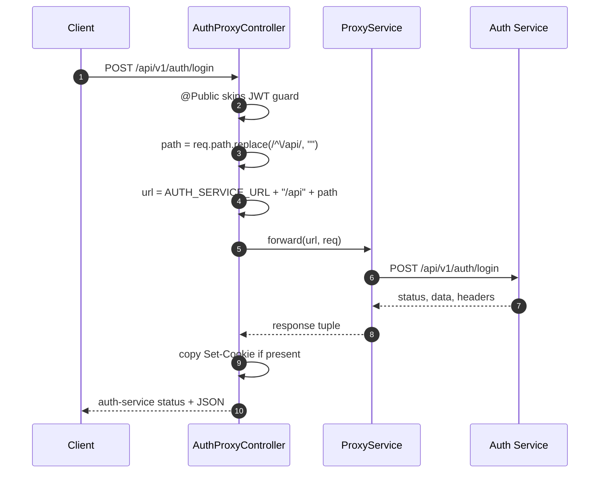

# API Gateway - Auth Proxy Endpoints

## Source Files

- `services/api-gateway/src/modules/auth/auth-proxy.controller.ts`
- `services/api-gateway/src/modules/auth/auth-proxy.module.ts`
- `services/api-gateway/src/common/services/proxy.service.ts`

## Purpose

`AuthProxyController` forwards authentication requests from the public API Gateway to `auth-service`. It keeps external clients pointed at one base API while auth business logic stays inside `auth-service`.

Target base URL:

```text
AUTH_SERVICE_URL default http://auth-service:3001
```

## Endpoint Table

Gateway prefix comes from `main.ts`:

```text
/api/v1
```

| Gateway Endpoint | Public | Downstream URL Built by Code |
| --- | --- | --- |
| `POST /api/v1/auth/register/initiate` | Yes | `${AUTH_SERVICE_URL}/api/v1/auth/register/initiate` |
| `POST /api/v1/auth/register/verify` | Yes | `${AUTH_SERVICE_URL}/api/v1/auth/register/verify` |
| `POST /api/v1/auth/login` | Yes | `${AUTH_SERVICE_URL}/api/v1/auth/login` |
| `POST /api/v1/auth/refresh` | Yes | `${AUTH_SERVICE_URL}/api/v1/auth/refresh` |
| `GET /api/v1/auth/social/start/:provider` | Yes | `${AUTH_SERVICE_URL}/api/v1/auth/social/start/:provider` |
| `POST /api/v1/auth/social/callback/:provider` | Yes | `${AUTH_SERVICE_URL}/api/v1/auth/social/callback/:provider` |
| `ALL /api/v1/auth/*` | No | `${AUTH_SERVICE_URL}/api/v1/auth/*` |

The protected wildcard is intended for routes such as `POST /auth/logout`.

## Flow



## Header and Cookie Behavior

Unlike the other proxy controllers, `AuthProxyController.forward()` reads upstream headers and forwards `Set-Cookie`:

```ts
const setCookie = headers["set-cookie"];
if (setCookie) {
  res.setHeader("Set-Cookie", setCookie);
}
```

This is important because `auth-service` stores the refresh token in an HTTP-only cookie.

## Security Notes

- Public auth routes use `@Public()` and bypass JWT validation.
- `POST /auth/refresh` is public at the gateway because it can authenticate using the refresh token cookie/body in `auth-service`.
- Any auth route not explicitly listed falls into `@All("*splat")`, requires a valid access token, and is then proxied to `auth-service`.

## Code-Level Constraints

- Path rewriting removes only the `/api` prefix, not `/v1`.
- The downstream service must also use `/api/v1` routes for paths to match.
- Request method, body, query, cookie, content type, IP, and user context headers are forwarded by `ProxyService`.
