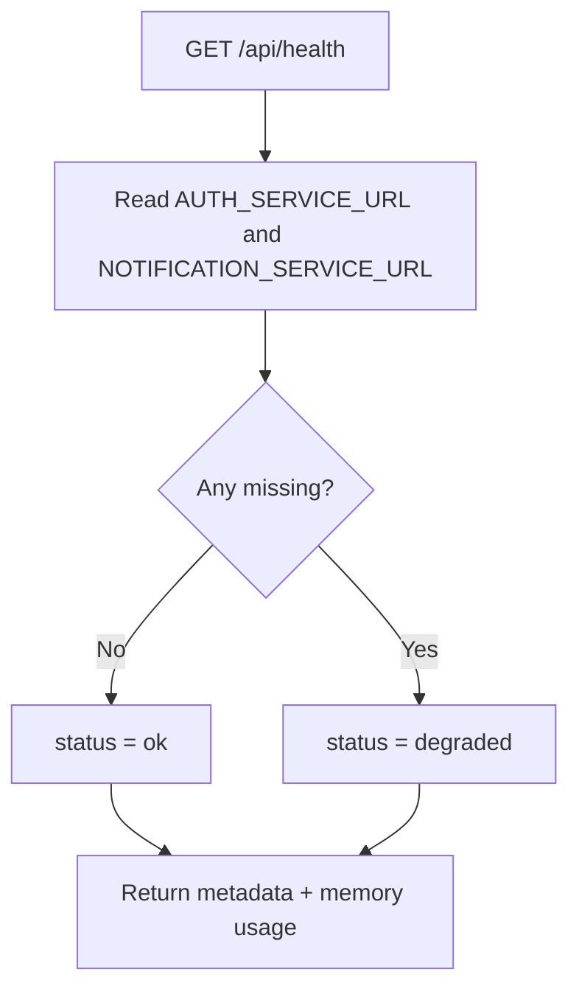

# API Gateway - Health Endpoint

## Source Files

- `services/api-gateway/src/modules/health/health.controller.ts`
- `services/api-gateway/src/modules/health/health.module.ts`

## Endpoint

```http
GET /api/health
```

This route is decorated with `@Public()`, so it bypasses JWT and role guards.

## Behavior

The endpoint does not ping downstream services. It validates local runtime/configuration state and returns an operational summary.

Current downstream route keys checked in code:

- `AUTH_SERVICE_URL`
- `NOTIFICATION_SERVICE_URL`

## Response Shape

```json
{
  "status": "ok",
  "service": "api-gateway",
  "version": "1.0.0",
  "environment": "development",
  "timestamp": "2026-05-10T04:00:00.000Z",
  "uptimeSeconds": 120,
  "checks": {
    "http": { "status": "ok" },
    "keycloak": {
      "status": "configured",
      "realm": "bin-ecommerce"
    },
    "downstreamRoutes": {
      "AUTH_SERVICE_URL": {
        "status": "configured",
        "url": "http://auth-service:3001"
      },
      "NOTIFICATION_SERVICE_URL": {
        "status": "configured",
        "url": "http://notification-service:3006"
      }
    },
    "memory": {
      "status": "ok",
      "rssMb": 80,
      "heapUsedMb": 35,
      "heapTotalMb": 50
    }
  }
}
```

## Status Rules



## Notes

- `KEYCLOAK_URL` is checked for configured/missing status only.
- The endpoint reports memory from `process.memoryUsage()`.
- It is suitable as a liveness/config-readiness endpoint, not a full dependency reachability probe.
