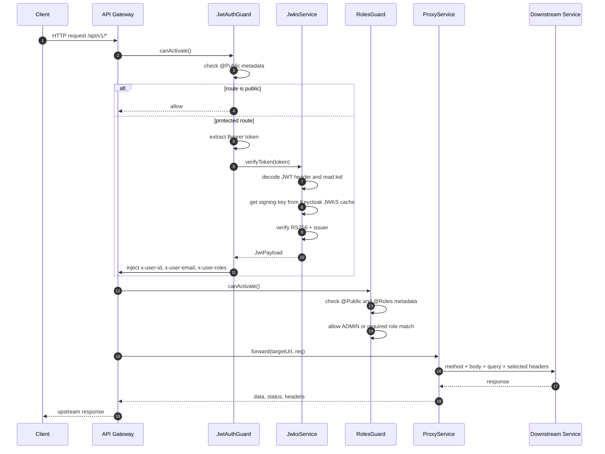

# API Gateway - JWT, RBAC, and Proxy Pipeline

## Source Files

- `services/api-gateway/src/main.ts`
- `services/api-gateway/src/app.module.ts`
- `services/api-gateway/src/common/decorators/public.decorator.ts`
- `services/api-gateway/src/common/decorators/roles.decorator.ts`
- `services/api-gateway/src/common/guards/jwt-auth.guard.ts`
- `services/api-gateway/src/common/guards/roles.guard.ts`
- `services/api-gateway/src/common/services/jwks.service.ts`
- `services/api-gateway/src/common/services/proxy.service.ts`

## Purpose

API Gateway is the public entry point for the backend. It validates JWT access tokens issued by Keycloak, injects trusted user context headers, enforces role metadata, and forwards requests to downstream services.

The gateway does not implement auth business logic itself. It delegates that to `auth-service` through proxy controllers.

## Runtime Setup

`main.ts` configures:

| Concern | Behavior in Code |
| --- | --- |
| Global prefix | `app.setGlobalPrefix("api")` |
| URI versioning | `VersioningType.URI`, default version `"1"` |
| Trust proxy | Express `trust proxy = 1` |
| Validation | `whitelist`, `forbidNonWhitelisted`, `transform` |
| CORS | `ALLOWED_ORIGINS`, default `http://localhost:5173` |
| Swagger | Enabled when `NODE_ENV !== "production"` |

## Request Pipeline



## JWT Verification Details

`JwksService` builds `expectedIssuer` from:

```text
${KEYCLOAK_URL}/realms/${KEYCLOAK_REALM}
```

It configures `jwks-rsa` with:

| Option | Value |
| --- | --- |
| `jwksUri` | `${issuer}/protocol/openid-connect/certs` |
| `cache` | `true` |
| `cacheMaxAge` | `3600000` milliseconds |
| `rateLimit` | `true` |
| `jwksRequestsPerMinute` | `10` |

`verifyToken()` accepts only `RS256` and validates issuer. If the token is invalid, expired, has no `kid`, or cannot be verified, `JwtAuthGuard` returns `401 Unauthorized` with message `Invalid or expired token`.

## Injected Headers

After JWT verification, `JwtAuthGuard` writes these headers into the request:

| Header | Source |
| --- | --- |
| `x-user-id` | JWT `sub` |
| `x-user-email` | JWT `email` |
| `x-user-roles` | `payload.roles.join(",")` |

`ProxyService` forwards only selected context headers downstream:

- `x-user-id`
- `x-user-email`
- `x-user-roles`
- `content-type`
- `cookie`
- `x-forwarded-for`

## RBAC Rules

`RolesGuard` checks `@Roles(...)` metadata. If no roles are required, protected routes pass after JWT verification.

Role logic:

1. Public routes skip role checks.
2. Routes without `@Roles()` pass.
3. Missing `x-user-roles` returns `403 Forbidden`.
4. `ADMIN` always passes.
5. Otherwise user must have at least one required role.

## Error Behavior

| Condition | Result |
| --- | --- |
| Missing bearer token on protected route | `401 Missing authorization token` |
| Invalid or expired token | `401 Invalid or expired token` |
| Missing role header on role-protected route | `403 Missing user roles context` |
| Required role not present | `403 Insufficient permissions` |
| Upstream returns an error response | Gateway forwards upstream status/data |
| Upstream unavailable without response | `500 Upstream service unavailable` |

## Notes From Code

- `ProxyService` uses `validateStatus: () => true`, so upstream HTTP errors are not thrown automatically.
- `AuthProxyController` explicitly forwards `Set-Cookie` from `auth-service` to the client.
- Other proxy controllers currently return JSON body/status but do not forward upstream response headers.
