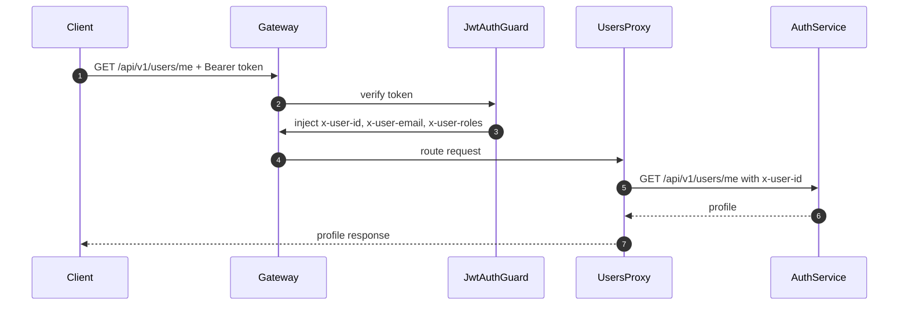

# API Gateway - User, Admin User, and Notification Proxies

## Source Files

- `services/api-gateway/src/modules/auth/users-proxy.controller.ts`
- `services/api-gateway/src/modules/auth/admin-users-proxy.controller.ts`
- `services/api-gateway/src/modules/notification/notification-proxy.controller.ts`
- `services/api-gateway/src/common/guards/jwt-auth.guard.ts`
- `services/api-gateway/src/common/guards/roles.guard.ts`

## Purpose

These controllers proxy protected business endpoints to downstream services after Gateway authentication and authorization have run.

## Endpoint Groups

| Gateway Controller | Gateway Route | Target Service | Target Base Env |
| --- | --- | --- | --- |
| `UsersProxyController` | `ALL /api/v1/users/*` | Auth Service | `AUTH_SERVICE_URL` |
| `AdminUsersProxyController` | `ALL /api/v1/admin/users/*` | Auth Service | `AUTH_SERVICE_URL` |
| `NotificationProxyController` | `ALL /api/v1/notifications/*` | Notification Service | `NOTIFICATION_SERVICE_URL` |

## User Proxy

`UsersProxyController` has no `@Public()` decorator, so it requires a valid JWT through `JwtAuthGuard`.

Typical downstream endpoints:

- `GET /api/v1/users/me`
- `PUT /api/v1/users/me`
- `GET /api/v1/users/me/addresses`
- `POST /api/v1/users/me/addresses`
- `PUT /api/v1/users/me/addresses/:id`
- `DELETE /api/v1/users/me/addresses/:id`



## Admin User Proxy

`AdminUsersProxyController` is decorated with:

```ts
@Roles(UserRole.SUPPORT_AGENT)
```

This means:

- User must pass JWT verification.
- User roles are read from `x-user-roles`.
- `ADMIN` bypasses specific role requirements.
- Otherwise `SUPPORT_AGENT` is required.

Downstream endpoints implemented by `auth-service`:

- `GET /api/v1/admin/users?page=1&limit=20`
- `PUT /api/v1/admin/users/:id/role`
- `PUT /api/v1/admin/users/:id/status`

## Notification Proxy

`NotificationProxyController` proxies `ALL /api/v1/notifications/*` to:

```text
NOTIFICATION_SERVICE_URL default http://notification-service:3006
```

Current `notification-service` code exposes:

- `GET /api/health`
- Kafka consumer for `notification.otp-requested`

There are no HTTP notification business endpoints in the current notification service source besides health. Therefore this proxy is infrastructure-ready, but no concrete notification HTTP feature is implemented yet in the downstream service.

## Forwarding Logic

All three controllers build downstream URL the same way:

```ts
const path = req.path.replace(/^\/api/, "");
const url = `${this.targetBase}/api${path}`;
```

For `/api/v1/users/me`, downstream becomes:

```text
${AUTH_SERVICE_URL}/api/v1/users/me
```

## Important Limitation

Only `AuthProxyController` forwards upstream `Set-Cookie`. These controllers return upstream data/status but do not copy upstream headers.
