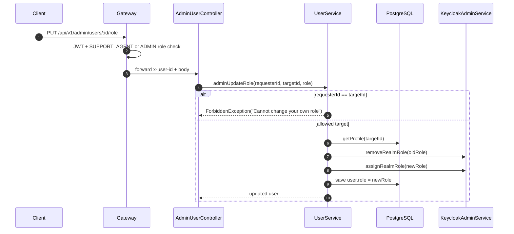
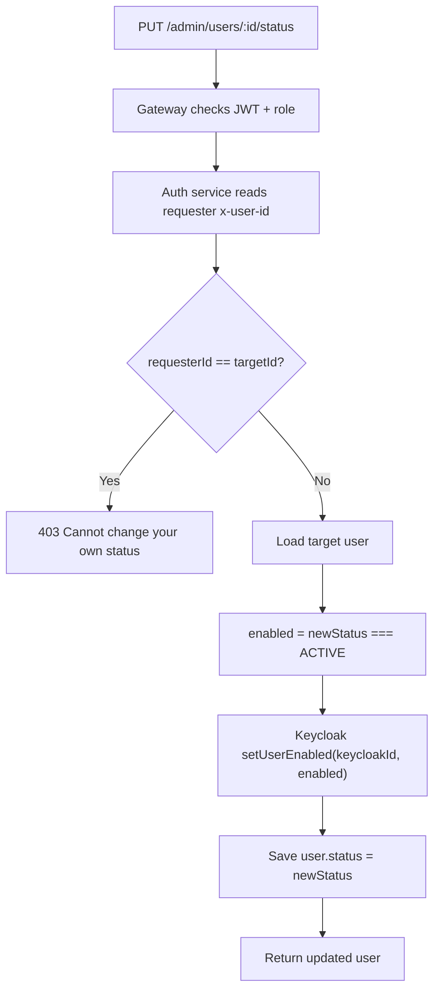

# Auth Service - Admin User Management

## Source Files

- `services/api-gateway/src/modules/auth/admin-users-proxy.controller.ts`
- `services/auth-service/src/modules/users/controllers/admin-user.controller.ts`
- `services/auth-service/src/modules/users/services/user.service.ts`
- `packages/common/enums/user-role.enum.ts`
- `packages/common/enums/user-status.enum.ts`

## Gateway Authorization

Admin user routes are protected at API Gateway by:

```ts
@Roles(UserRole.SUPPORT_AGENT)
@Controller("admin/users")
```

`RolesGuard` also allows `ADMIN` regardless of specific required role.

## Endpoints

| Method | Path | Purpose |
| --- | --- | --- |
| `GET` | `/api/v1/admin/users?page=1&limit=20` | List users |
| `PUT` | `/api/v1/admin/users/:id/role` | Change user role |
| `PUT` | `/api/v1/admin/users/:id/status` | Change user status |

## List Users

Query parameters:

| Param | Default | Rule |
| --- | --- | --- |
| `page` | `1` | parsed as integer |
| `limit` | `20` | parsed as integer, capped at `100` |

Service call:

```ts
this.userRepo.findAndCount({
  order: { createdAt: "DESC" },
  skip: (page - 1) * limit,
  take: limit,
});
```

Response body:

```json
{
  "data": {
    "data": [],
    "total": 0
  },
  "message": "Users retrieved",
  "statusCode": 200
}
```

## Update Role Request

```json
{
  "role": "SUPPORT_AGENT"
}
```

Validation:

- `role` must be one of `UserRole` enum values.

Available roles in code:

- `CUSTOMER`
- `CATALOG_MANAGER`
- `INVENTORY_MANAGER`
- `ORDER_MANAGER`
- `SHIPPING_MANAGER`
- `PROMOTION_MANAGER`
- `RETURN_MANAGER`
- `ANALYST`
- `SUPPORT_AGENT`
- `ADMIN`

## Update Role Flow



## Update Status Request

```json
{
  "status": "BANNED"
}
```

Validation:

- `status` must be one of `ACTIVE`, `INACTIVE`, `BANNED`.

## Update Status Flow



## Important Implementation Notes

- RBAC is enforced in API Gateway, not inside `AdminUserController`.
- `AdminUserController` trusts `x-user-id` from the gateway.
- There are TODO comments for Kafka `user.role-changed` and `user.status-changed` events; they are not implemented in current code.
- Users cannot change their own role or status through these endpoints.
