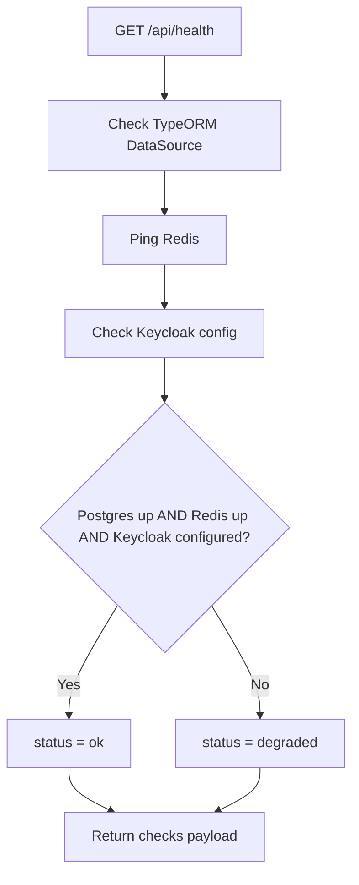

# Auth Service - Health Endpoint

## Source Files

- `services/auth-service/src/modules/health/health.controller.ts`
- `services/auth-service/src/modules/health/health.module.ts`
- `services/auth-service/src/app.module.ts`

## Endpoint

```http
GET /api/health
```

`HealthModule` is imported in `AppModule`.

## Checks Performed

| Check | Code Behavior |
| --- | --- |
| HTTP | Always returns `{ status: "ok" }` if controller executes |
| PostgreSQL | Uses `DataSource.isInitialized` |
| Redis | Calls `redis.ping()` with an 800ms timeout |
| Kafka | Reports configured broker list from `KAFKA_BROKERS` |
| Keycloak | Checks that `KEYCLOAK_URL`, `KEYCLOAK_REALM`, and `KEYCLOAK_CLIENT_ID` exist |
| Memory | Reads `process.memoryUsage()` |

## Status Rules



## Example Response

```json
{
  "status": "ok",
  "service": "auth-service",
  "version": "1.0.0",
  "environment": "development",
  "timestamp": "2026-05-10T04:00:00.000Z",
  "uptimeSeconds": 100,
  "checks": {
    "http": { "status": "ok" },
    "postgres": {
      "status": "up",
      "database": "bin_auth",
      "type": "postgres"
    },
    "redis": {
      "status": "up",
      "latencyMs": 2
    },
    "kafka": {
      "status": "configured",
      "brokers": ["localhost:9092"]
    },
    "keycloak": {
      "status": "configured",
      "realm": "bin-ecommerce",
      "url": "http://localhost:8080"
    },
    "memory": {
      "status": "ok",
      "rssMb": 90,
      "heapUsedMb": 40,
      "heapTotalMb": 56
    }
  }
}
```

## Notes

- Kafka is not pinged; only broker configuration is reported.
- Keycloak is not pinged; only required config is checked.
- Redis ping is the only active network dependency check in this controller.
