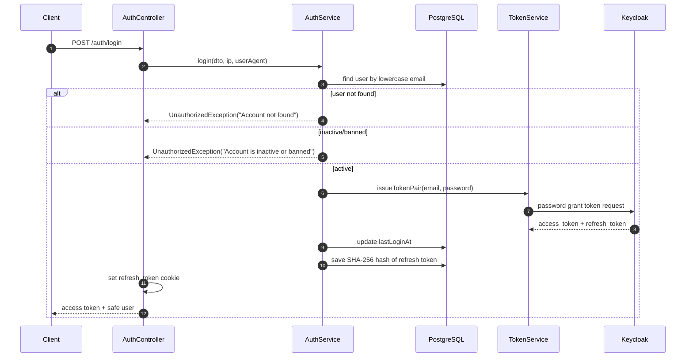
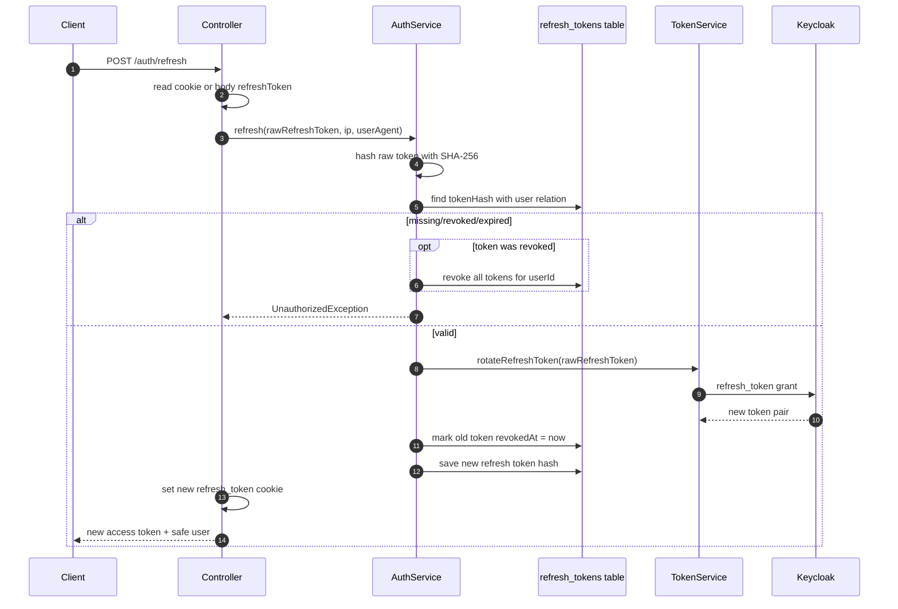
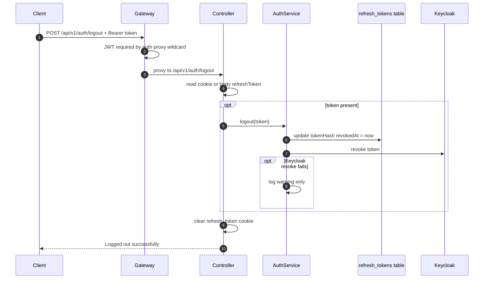

# Auth Service - Login, Refresh, and Logout

## Source Files

- `services/auth-service/src/modules/auth/controllers/auth.controller.ts`
- `services/auth-service/src/modules/auth/services/auth.service.ts`
- `services/auth-service/src/modules/auth/services/token.service.ts`
- `services/auth-service/src/database/entities/refresh-token.entity.ts`
- `services/auth-service/src/modules/auth/dto/login.dto.ts`
- `services/auth-service/src/modules/auth/dto/refresh.dto.ts`

## Endpoints

| Method | Path | Gateway Visibility | Purpose |
| --- | --- | --- | --- |
| `POST` | `/api/v1/auth/login` | Public | Authenticate email/password and start session |
| `POST` | `/api/v1/auth/refresh` | Public | Rotate refresh token and issue new access token |
| `POST` | `/api/v1/auth/logout` | Protected by gateway wildcard | Revoke refresh token and clear cookie |

## Login Request

```json
{
  "email": "user@example.com",
  "password": "Password1"
}
```

Validation:

- `email` must be a valid email.
- `password` must be a non-empty string.

## Login Flow



## Refresh Flow

`AuthController.refresh()` reads the refresh token from:

1. HTTP-only cookie `refresh_token`
2. request body `refreshToken`

If both are missing, it throws:

```text
UnauthorizedException("Refresh token missing")
```



## Logout Flow



## Refresh Token Storage

`RefreshToken` entity stores:

| Column | Purpose |
| --- | --- |
| `user_id` | owner user |
| `token_hash` | SHA-256 hash, indexed |
| `issued_at` | created timestamp |
| `expires_at` | refresh token expiry from Keycloak |
| `revoked_at` | non-null means revoked |
| `ip_address` | request IP when token was saved |
| `user_agent` | request user-agent when token was saved |

## Security Behavior

- Raw refresh tokens are not stored in DB.
- Refresh token rotation revokes the old token before storing the new one.
- Reuse of a revoked token triggers revocation of all tokens for that user.
- JSON response never returns `refreshToken`; the controller strips it before returning.
