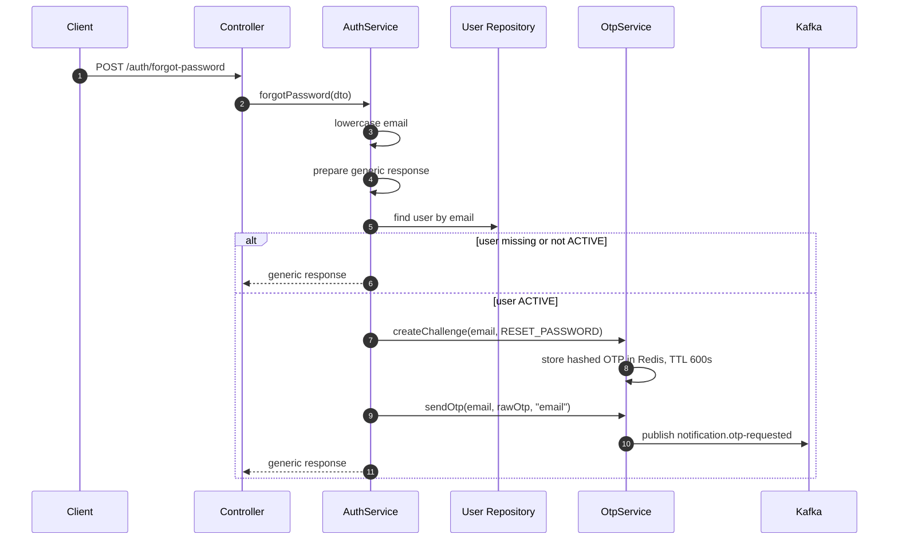
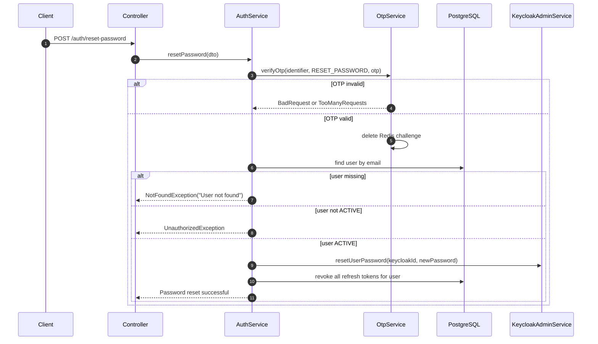

# Auth Service - Forgot Password and Reset Password

## Source Files

- `services/auth-service/src/modules/auth/controllers/auth.controller.ts`
- `services/auth-service/src/modules/auth/services/auth.service.ts`
- `services/auth-service/src/modules/auth/services/otp.service.ts`
- `services/auth-service/src/modules/auth/services/keycloak-admin.service.ts`
- `services/auth-service/src/modules/auth/dto/forgot-password.dto.ts`
- `services/auth-service/src/modules/auth/dto/reset-password.dto.ts`

## Endpoints

| Method | Path | Purpose |
| --- | --- | --- |
| `POST` | `/api/v1/auth/forgot-password` | Create reset-password OTP when eligible |
| `POST` | `/api/v1/auth/reset-password` | Verify OTP, reset Keycloak password, revoke sessions |

These routes are handled by `AuthController`. In the gateway, they fall under the auth proxy wildcard unless explicitly listed as public.

## Forgot Password Request

```json
{
  "email": "user@example.com"
}
```

Validation:

- `email`: valid email, max length 255.

## Forgot Password Flow



## Enumeration Protection

The service always returns the same message whether the email exists or not:

```json
{
  "message": "If the email exists, an OTP has been sent",
  "expiresIn": 600
}
```

## Reset Password Request

```json
{
  "identifier": "user@example.com",
  "otp": "123456",
  "newPassword": "NewPassword1"
}
```

Validation:

| Field | Rule |
| --- | --- |
| `identifier` | email, max 255 |
| `otp` | exactly six digits |
| `newPassword` | string, min 8, max 128, at least one uppercase letter and one digit |

## Reset Password Flow



## Session Impact

After password reset, code revokes all refresh tokens for the user:

```ts
await this.refreshTokenRepo.update(
  { userId: user.id },
  { revokedAt: new Date() },
);
```

This forces all existing sessions to log in again.

## Important Implementation Detail

`OtpService.sendOtp()` currently publishes the Kafka payload with `purpose: "REGISTER"` regardless of the OTP purpose passed to `createChallenge()`. The reset-password OTP is verified correctly under `OtpPurpose.RESET_PASSWORD`, but the notification email purpose label may not match reset-password intent until `sendOtp()` is adjusted to accept and publish the actual purpose.
