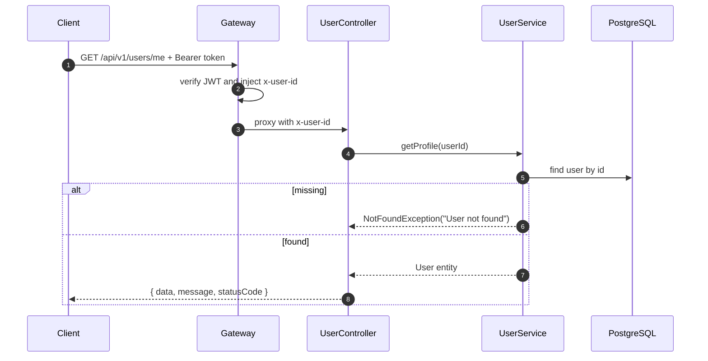
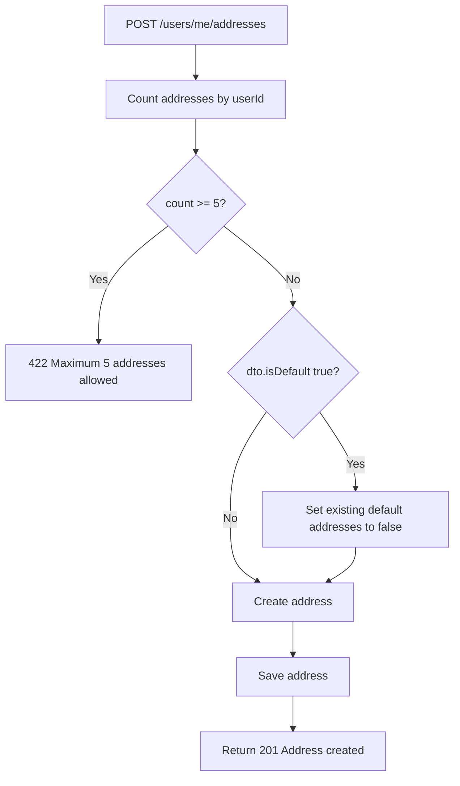
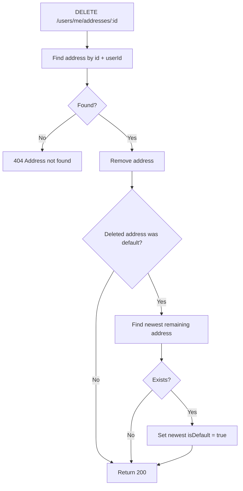

# Auth Service - User Profile and Addresses

## Source Files

- `services/auth-service/src/modules/users/controllers/user.controller.ts`
- `services/auth-service/src/modules/users/services/user.service.ts`
- `services/auth-service/src/modules/users/dto/update-profile.dto.ts`
- `services/auth-service/src/modules/users/dto/create-address.dto.ts`
- `services/auth-service/src/modules/users/dto/update-address.dto.ts`
- `services/auth-service/src/database/entities/user.entity.ts`
- `services/auth-service/src/database/entities/user-address.entity.ts`

## Gateway Context

These routes are normally reached through API Gateway:

```text
/api/v1/users/*
```

Gateway validates JWT and forwards `x-user-id`. `UserController` trusts that header.

## Endpoints

| Method | Path | Purpose |
| --- | --- | --- |
| `GET` | `/api/v1/users/me` | Get current user profile |
| `PUT` | `/api/v1/users/me` | Update profile fields |
| `GET` | `/api/v1/users/me/addresses` | List addresses |
| `POST` | `/api/v1/users/me/addresses` | Create address |
| `PUT` | `/api/v1/users/me/addresses/:id` | Update address |
| `DELETE` | `/api/v1/users/me/addresses/:id` | Delete address |

## Profile Flow



## Update Profile Request

```json
{
  "name": "Nguyen Van A",
  "phone": "0912345678",
  "avatarUrl": "https://example.com/avatar.png"
}
```

All fields are optional.

Validation:

| Field | Rule |
| --- | --- |
| `name` | string, min 2, max 100 |
| `phone` | Vietnamese phone regex `^0[3-9][0-9]{8}$` |
| `avatarUrl` | URL, max 500 |

Only fields that are not `undefined` are assigned.

## Address Entity Rules

`UserAddress` has a partial unique index:

```ts
@Index(["userId"], { unique: true, where: '"is_default" = true' })
```

This enforces only one default address per user at DB level.

## Create Address Request

```json
{
  "label": "Home",
  "fullName": "Nguyen Van A",
  "phone": "0912345678",
  "province": "Ho Chi Minh",
  "district": "District 1",
  "ward": "Ben Nghe",
  "street": "123 Le Loi",
  "isDefault": true
}
```

Validation:

| Field | Rule |
| --- | --- |
| `label` | string, max 50 |
| `fullName` | string, max 100 |
| `phone` | Vietnamese phone regex |
| `province` | string, max 100 |
| `district` | string, max 100 |
| `ward` | string, max 100 |
| `street` | string, max 500 |
| `isDefault` | optional boolean |

## Address Create Flow



## Update Address Flow

1. Find address by `id` and `userId`.
2. If missing, throw `NotFoundException("Address not found")`.
3. If `dto.isDefault === true` and existing address is not default, clear existing default address for the user.
4. `Object.assign(address, dto)`.
5. Save and return updated address.

## Delete Address Flow



## Known Constraints

- The current service trusts `x-user-id`; direct exposure without API Gateway would be unsafe.
- Maximum addresses is a hard-coded constant: `MAX_ADDRESSES = 5`.
- Address delete reassigns default to newest remaining address by `createdAt DESC`.
