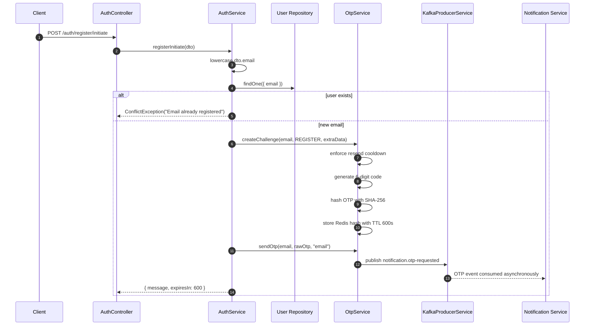
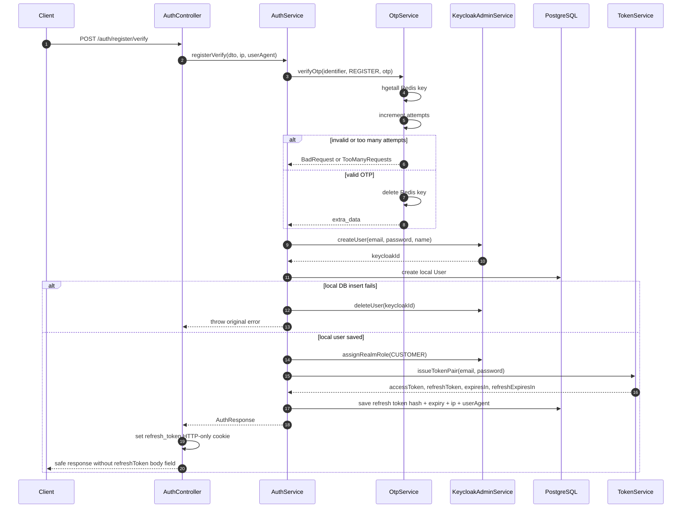

# Auth Service - Registration with OTP

## Source Files

- `services/auth-service/src/modules/auth/controllers/auth.controller.ts`
- `services/auth-service/src/modules/auth/services/auth.service.ts`
- `services/auth-service/src/modules/auth/services/otp.service.ts`
- `services/auth-service/src/modules/auth/services/keycloak-admin.service.ts`
- `services/auth-service/src/modules/auth/services/token.service.ts`
- `services/auth-service/src/modules/auth/dto/register-initiate.dto.ts`
- `services/auth-service/src/modules/auth/dto/register-verify.dto.ts`

## Endpoints

| Method | Path | Purpose |
| --- | --- | --- |
| `POST` | `/api/v1/auth/register/initiate` | Validate registration input and send OTP |
| `POST` | `/api/v1/auth/register/verify` | Verify OTP, create user, issue token pair |

Both routes are public at the API Gateway.

## Request: Register Initiate

```json
{
  "email": "user@example.com",
  "password": "Password1",
  "name": "Nguyen Van A",
  "phone": "0912345678"
}
```

Validation from `RegisterInitiateDto`:

| Field | Rule |
| --- | --- |
| `email` | email, max 255 |
| `password` | string, min 8, max 100, at least one uppercase letter and one digit |
| `name` | string, min 2, max 100 |
| `phone` | optional, must match `^0[3-9][0-9]{8}$` |

## Initiate Flow



## Redis OTP Data

`OtpService.createChallenge()` stores a Redis hash at:

```text
otp:REGISTER:<email>
```

Fields written:

| Field | Meaning |
| --- | --- |
| `otp_hash` | SHA-256 hash of raw OTP |
| `resend_at` | timestamp in milliseconds before next OTP is allowed |
| `attempts` | starts at `0` |
| `max_attempts` | `3` |
| `extra_data` | JSON containing `name`, `phone`, `passwordForKc` |

TTL is `600` seconds.

## Request: Register Verify

```json
{
  "identifier": "user@example.com",
  "otp": "123456"
}
```

Validation from `RegisterVerifyDto`:

| Field | Rule |
| --- | --- |
| `identifier` | email |
| `otp` | string length exactly 6 |

## Verify Flow



## Response

`AuthController.registerVerify()` sets the `refresh_token` cookie and removes `refreshToken` from the JSON body.

Cookie options:

| Option | Value |
| --- | --- |
| `httpOnly` | `true` |
| `secure` | `NODE_ENV === "production"` |
| `sameSite` | `lax` |
| `path` | `/api/v1/auth` |
| `maxAge` | 7 days |

Body shape:

```json
{
  "data": {
    "accessToken": "...",
    "expiresIn": 300,
    "user": {
      "id": "...",
      "email": "user@example.com",
      "name": "Nguyen Van A",
      "phone": "0912345678",
      "role": "CUSTOMER",
      "status": "ACTIVE",
      "avatarUrl": null,
      "createdAt": "..."
    }
  },
  "message": "Registration successful",
  "statusCode": 201
}
```

## Important Implementation Notes

- `passwordForKc` is stored temporarily in Redis `extra_data`; source code marks this with `SECURITY_TODO: encrypt before production`.
- Keycloak user creation happens before local DB insert.
- If local DB insert fails, `AuthService` compensates by deleting the Keycloak user.
- Role assignment failure is logged but does not fail registration.
