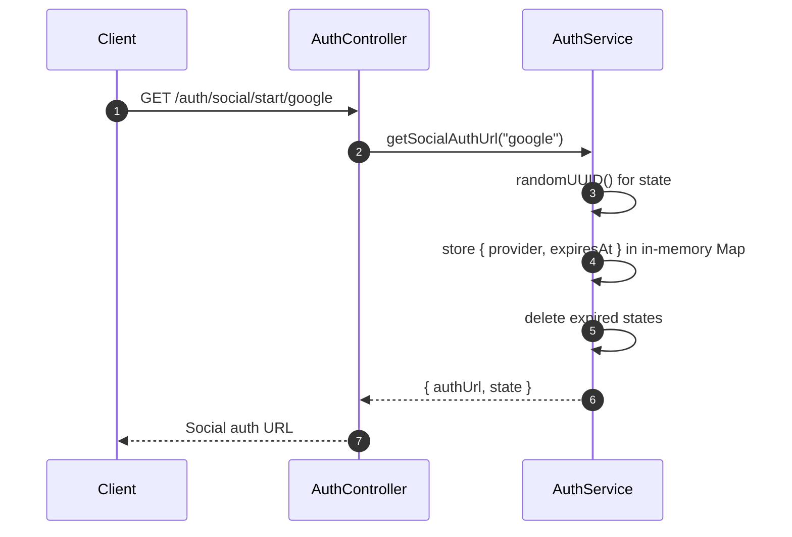
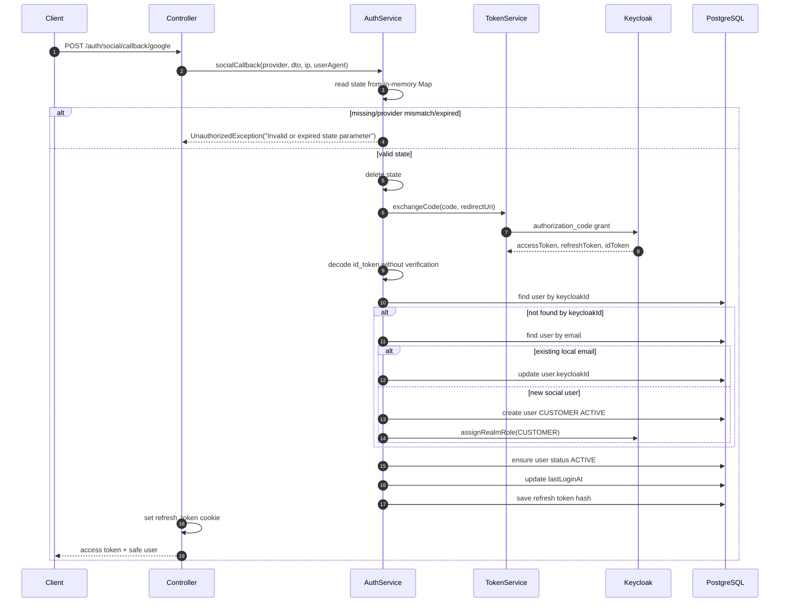

# Auth Service - Social Authentication

## Source Files

- `services/auth-service/src/modules/auth/controllers/auth.controller.ts`
- `services/auth-service/src/modules/auth/services/auth.service.ts`
- `services/auth-service/src/modules/auth/services/token.service.ts`
- `services/auth-service/src/modules/auth/services/keycloak-admin.service.ts`
- `services/auth-service/src/modules/auth/dto/social-callback.dto.ts`

## Endpoints

| Method | Path | Purpose |
| --- | --- | --- |
| `GET` | `/api/v1/auth/social/start/:provider` | Generate Keycloak social authorization URL |
| `POST` | `/api/v1/auth/social/callback/:provider` | Exchange code, upsert/link local user, issue session |

Both routes are public at the API Gateway.

## Start Flow



## Generated Auth URL

The URL is built from:

| Config | Use |
| --- | --- |
| `KEYCLOAK_URL` | Keycloak base |
| `KEYCLOAK_REALM` | Realm |
| `KEYCLOAK_WEB_CLIENT_ID` | OAuth client id, default `web-client` |
| `FRONTEND_URL` | Callback base, default `http://localhost:5173` |
| `provider` path param | `kc_idp_hint` |

Query params include:

- `client_id`
- `response_type=code`
- `scope=openid email profile`
- `redirect_uri=${FRONTEND_URL}/auth/callback`
- `state`
- `kc_idp_hint=${provider}`

## Callback Request

```json
{
  "code": "authorization-code-from-keycloak",
  "state": "state-returned-from-start"
}
```

Validation:

- `code` is required string.
- `state` is required string.

## Callback Flow



## Current Implementation Details

- State storage is an in-memory `Map`; restarting the service clears pending states.
- State expiry is 10 minutes.
- `id_token` is decoded with `jwt.decode()` because Keycloak has already returned it from the code exchange. The code does not perform separate signature verification at this step.
- If `email` is missing from the provider, the service returns `UnauthorizedException("Email not provided by identity provider")`.
- New social users receive role `CUSTOMER` and status `ACTIVE`.
- There is a TODO comment for publishing `user.registered` event, but it is not implemented in current code.
