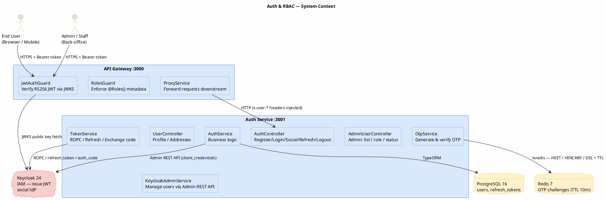
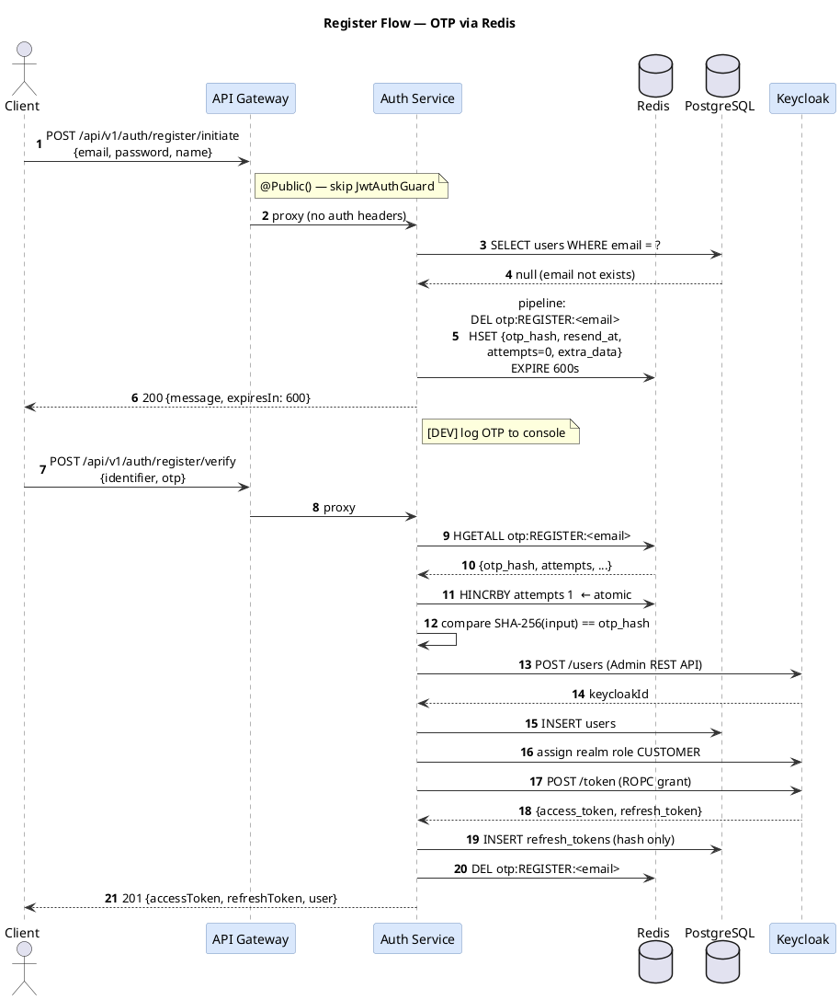
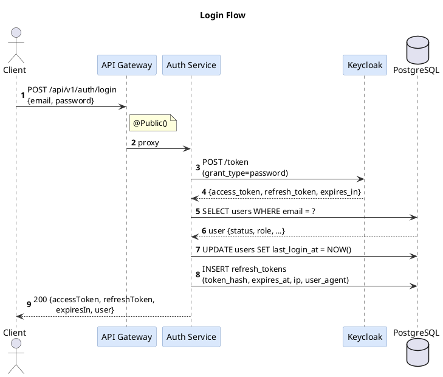
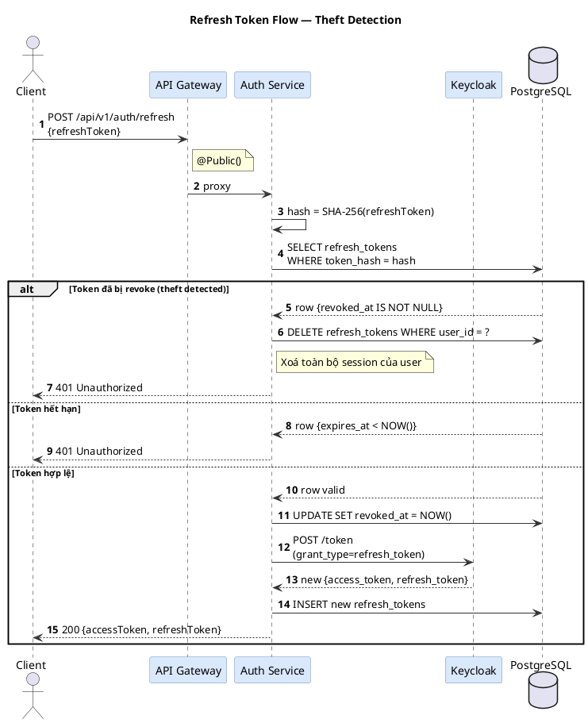
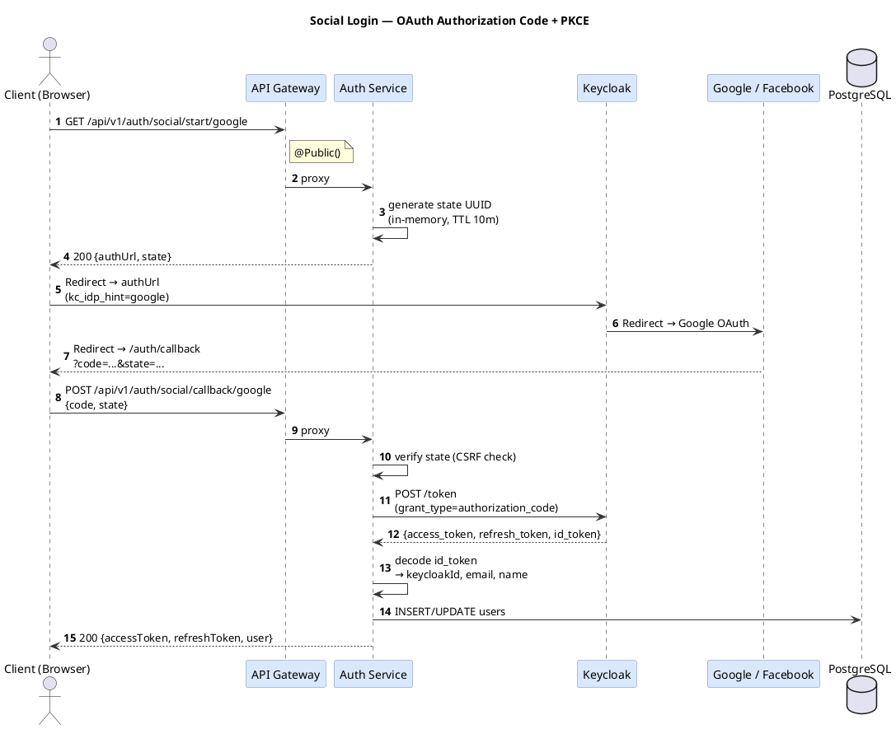
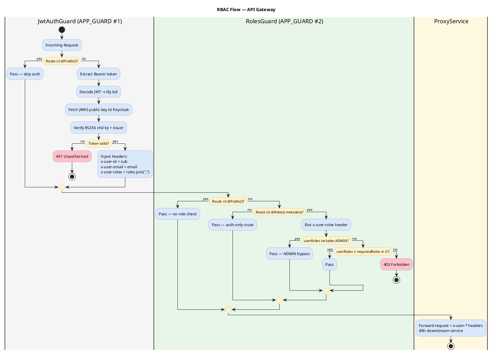
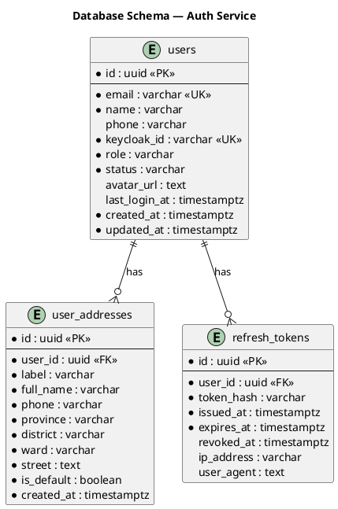
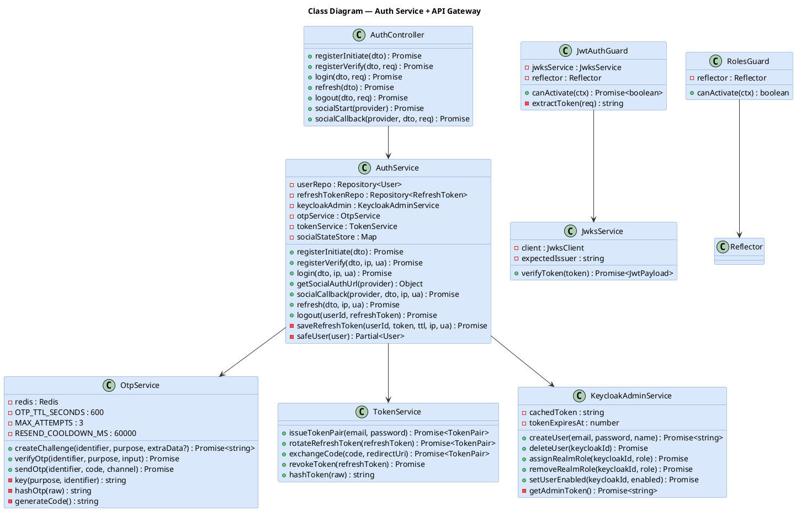

# Auth & RBAC Architecture

## 1. Tổng quan thành phần (C4 Context)



---

## 2. Chi tiết luồng Register (OTP)



---

## 3. Chi tiết luồng Login



---

## 4. Chi tiết luồng Refresh Token (với Theft Detection)



---

## 5. Chi tiết luồng Social Login (OAuth Authorization Code + PKCE)



---

## 6. Luồng RBAC tại API Gateway



---

## 7. Entity Relationship Diagram



**Redis (ngoài SQL):**

```
Key:   otp:{purpose}:{identifier}
Type:  Hash
TTL:   600s (auto-expire)

Fields:
  otp_hash      — SHA-256(raw_otp)
  resend_at     — Unix ms timestamp (cooldown 60s)
  attempts      — int (max 3, HINCRBY atomic)
  max_attempts  — int (default 3)
  extra_data    — JSON string (register: {name, phone, passwordForKc})
```

---

## 8. Class Diagram — Auth Service



---

## 9. Ưu & Nhược điểm

### ✅ Ưu điểm

| Khía cạnh                         | Chi tiết                                                                                                 |
| --------------------------------- | -------------------------------------------------------------------------------------------------------- |
| **Bảo mật token**                 | JWT RS256 — private key nằm trong Keycloak, gateway chỉ cần public key qua JWKS. Không cần shared secret |
| **Stateless verification**        | Gateway verify token hoàn toàn offline sau khi cache JWKS. Không cần gọi auth-service mỗi request        |
| **Refresh token theft detection** | Dùng token rotation + detect reuse: nếu token đã revoke được dùng lại → xoá toàn bộ session              |
| **OTP brute-force protection**    | `HINCRBY` atomic trên Redis — không thể race condition, tự expire sau 10 phút                            |
| **OTP resend cooldown**           | 60s cooldown lưu trong Redis hash, không cần bảng riêng                                                  |
| **Compensating transaction**      | Nếu DB insert user thất bại sau khi tạo trên Keycloak → tự động xoá Keycloak user                        |
| **CSRF protection (social)**      | State UUID lưu in-memory với TTL 10 phút, verify trước khi exchange code                                 |
| **ADMIN bypass**                  | ADMIN role bypass toàn bộ `@Roles()` check — không cần liệt kê trong mọi route                           |
| **Header injection**              | Gateway inject `x-user-*` một lần → downstream không cần xác thực lại JWT                                |
| **Tách biệt concern**             | Auth logic ở auth-service, traffic control ở gateway — mỗi thứ làm đúng vai trò                          |

### ⚠️ Nhược điểm & Hạn chế hiện tại

| Khía cạnh                              | Chi tiết                                                                                                               | Hướng giải quyết                                                   |
| -------------------------------------- | ---------------------------------------------------------------------------------------------------------------------- | ------------------------------------------------------------------ |
| **Token không thể revoke ngay**        | Access token RS256 có hiệu lực đến khi hết TTL (15 phút) dù logout — gateway chỉ verify chữ ký, không check blacklist  | Thêm Redis token blacklist hoặc giảm access token TTL xuống 5 phút |
| **ROPC flow (deprecated)**             | `grant_type=password` bị deprecated trong OAuth 2.1. Keycloak vẫn hỗ trợ nhưng không được khuyến nghị cho production   | Migrate sang Authorization Code + PKCE ngay cả với first-party app |
| **`passwordForKc` lưu trong Redis**    | `extraData` chứa password plaintext trong Redis TTL 10 phút khi đăng ký. SECURITY_TODO đã ghi chú                      | Encrypt `extraData` bằng AES-GCM với key từ env trước khi lưu      |
| **Social state in-memory**             | `socialStateStore` là Map trong process memory — mất khi restart, không scale ngang                                    | Migrate sang Redis với TTL 10 phút                                 |
| **Keycloak Admin token cache**         | Cache in-memory, mất khi restart. Nếu nhiều pod thì mỗi pod có 1 cache riêng                                           | Dùng Redis để share cache token giữa các pod                       |
| **Không có token introspection**       | Downstream service tin tuyệt đối `x-user-*` header từ gateway — nếu gateway bị bypass thì không có lớp bảo vệ nào      | Thêm internal mTLS hoặc signed header giữa gateway và services     |
| **Kafka TODO**                         | `user.registered`, `user.role-changed`, `user.status-changed` chưa publish — các service khác không biết user thay đổi | Implement Kafka producer trong auth-service                        |
| **OtpChallenge entity còn tồn tại**    | Entity `OtpChallenge` vẫn còn trong codebase dù không dùng nữa                                                         | Tạo migration drop table, xoá entity file                          |
| **Không có rate limit riêng cho auth** | ThrottlerModule áp 100 req/min toàn gateway — `/auth/login` và `/auth/register` nên có limit thấp hơn nhiều            | Dùng `@Throttle()` riêng cho auth routes: 5 req/min                |
