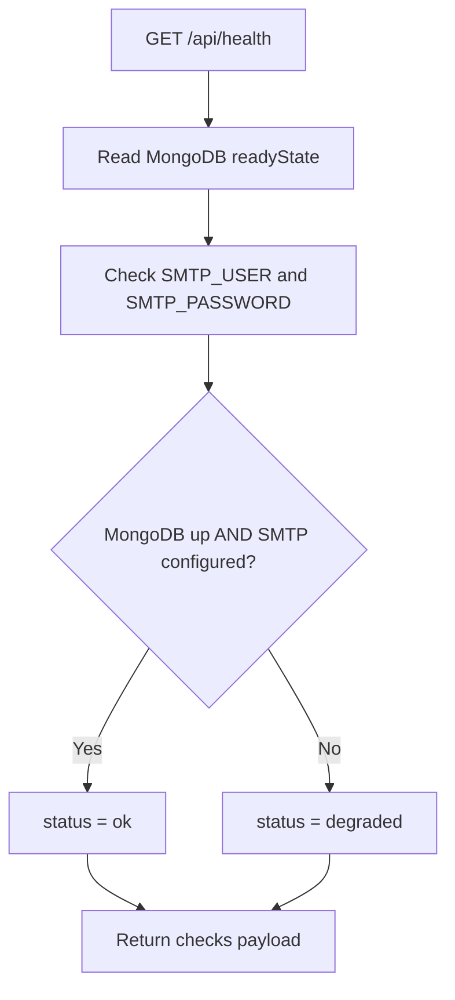

# Notification Service - Health Endpoint

## Source Files

- `services/notification-service/src/modules/health/health.controller.ts`
- `services/notification-service/src/modules/health/health.module.ts`

## Endpoint

```http
GET /api/health
```

## Checks Performed

| Check | Code Behavior |
| --- | --- |
| HTTP | Always reports `ok` when endpoint executes |
| Kafka | Reports configured brokers from `KAFKA_BROKERS` |
| MongoDB | Reads Mongoose connection `readyState`, `name`, and `host` |
| SMTP | Checks `SMTP_USER` and `SMTP_PASSWORD` presence |
| Memory | Reports RSS, heap used, and heap total in MB |

## MongoDB State Mapping

```ts
switch (connection.readyState) {
  case 1: return "up";
  case 2: return "connecting";
  case 3: return "disconnecting";
  default: return "down";
}
```

## Status Rules



## Example Response

```json
{
  "status": "ok",
  "service": "notification-service",
  "version": "1.0.0",
  "environment": "development",
  "timestamp": "2026-05-10T04:00:00.000Z",
  "uptimeSeconds": 60,
  "checks": {
    "http": { "status": "ok" },
    "kafka": {
      "status": "configured",
      "brokers": ["localhost:9092"]
    },
    "mongodb": {
      "status": "up",
      "name": "bin_notification",
      "host": "localhost"
    },
    "smtp": {
      "status": "configured",
      "host": "smtp.gmail.com",
      "port": 587
    },
    "memory": {
      "status": "ok",
      "rssMb": 92,
      "heapUsedMb": 38,
      "heapTotalMb": 54
    }
  }
}
```

## Notes

- Kafka is not pinged; only configuration is returned.
- SMTP is not pinged; only credentials and host/port configuration are returned.
- MongoDB readiness is based on the current Mongoose connection state.
