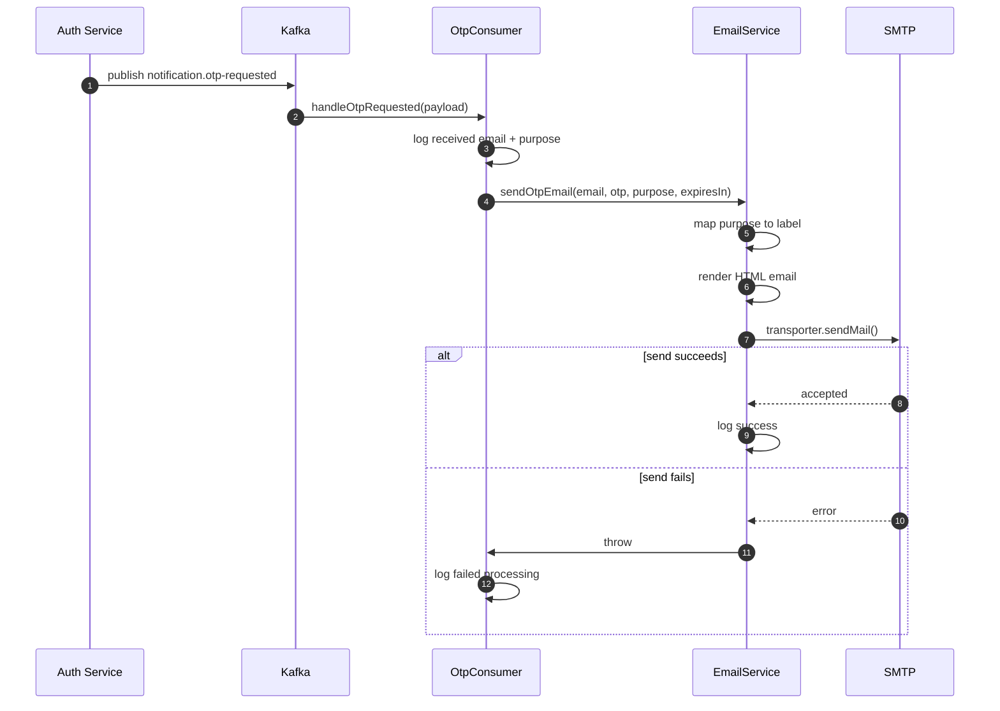

# Notification Service - OTP Email Consumer

## Source Files

- `services/notification-service/src/main.ts`
- `services/notification-service/src/app.module.ts`
- `services/notification-service/src/kafka/consumers/otp.consumer.ts`
- `services/notification-service/src/modules/email/email.service.ts`
- `services/notification-service/src/modules/email/email.module.ts`
- `packages/common/kafka/events/notification.events.ts`

## Purpose

Notification Service receives OTP events from Kafka and sends email through SMTP. It does not generate OTP codes and does not verify OTP codes. OTP generation and verification live in `auth-service`.

## Kafka Runtime

`main.ts` connects a Kafka microservice:

| Setting | Value |
| --- | --- |
| Transport | `Transport.KAFKA` |
| `clientId` | `notification-service` |
| `consumer.groupId` | `notification-service` |
| brokers | `KAFKA_BROKERS`, default `localhost:9092` |

The HTTP app and Kafka microservice start together:

```ts
await app.startAllMicroservices();
await app.listen(port);
```

## Event Contract

Topic from shared package:

```text
notification.otp-requested
```

Payload:

```ts
interface OtpRequestedPayload {
  email: string;
  otp: string;
  purpose: "REGISTER" | "RESET_PASSWORD" | "LOGIN";
  expiresIn: number;
}
```

## Consumer Flow



## Email Rendering

`EmailService.sendOtpEmail()` derives `purposeLabel`:

| Purpose | Label |
| --- | --- |
| `REGISTER` | `xac nhan dang ky` |
| `RESET_PASSWORD` | `dat lai mat khau` |
| other | `xac thuc` |

Email subject:

```text
[Bin] Ma OTP <purposeLabel>: <otp>
```

Sender:

```text
"Bin E-Commerce" <SMTP_USER>
```

SMTP configuration:

| Config | Default |
| --- | --- |
| `SMTP_HOST` | `smtp.gmail.com` |
| `SMTP_PORT` | `587` |
| `SMTP_USER` | empty |
| `SMTP_PASSWORD` | empty |
| secure mode | `true` only when port is `465` |

## Error Handling

`OtpConsumer` catches errors from `EmailService` and logs:

```text
Failed to process OTP for <email>: <error>
```

It does not rethrow. Based on current code, this prevents the handler from crashing the process on SMTP failure. It also means retry semantics are not explicitly implemented in application code.

## Deployment Notes

- Without valid SMTP credentials, the transporter is still created but sending mail will fail.
- Kafka brokers are parsed from comma-separated `KAFKA_BROKERS`.
- The service also starts an HTTP server for health and Swagger docs.
